# qemu-kvm コンテナ 仕様書

本書は、このリポジトリ (qemu-kvm / libvirt / cockpit / firefox / virt-manager を 1 つの systemd コンテナに同梱し、
軽量なホストで VM を動かしてその画面をホストのデスクトップに表示する仕組み) の **現状の実装 (as-built) を仕様として記述したもの**です。

| 項目 | 内容 |
| --- | --- |
| 対象コミット | `21f0a5c` (main) |
| 対象読者 | 利用者 (CLI・環境変数・ポート・データの扱いを知りたい人) と保守者 (起動/停止の順序、各 unit の役割、変えてはいけない構成を知りたい人) |
| 出典 | `kvm.sh` `host/wsl.sh` `Containerfile` `container/*` `desktop/*` `.gitignore`、README.md、CLAUDE.md、git の変更履歴。本書はこれらに書かれている事実のみを記述し、実装に無い振る舞いは書かない |
| 他文書との分担 | README.md = 導入手順と使い方、CLAUDE.md = 変更時の注意点、本書 = 振る舞いの定義。手順は README を参照し、本書では繰り返さない |
| 記法 | 実行時メッセージとコード内コメントは英語なので原文のまま引用する。`>> ` は進捗、`!! ` は警告/エラー (stderr)。図中の `UID` はホストユーザーの uid、`USER` はホストユーザー名、`PORT` は `COCKPIT_PORT` を表す |

目次

1. [概要](#1-概要)
2. [対応環境・前提条件](#2-対応環境前提条件)
3. [システム構成](#3-システム構成)
4. [外部インターフェース仕様](#4-外部インターフェース仕様)
5. [内部仕様 (処理シーケンス)](#5-内部仕様-処理シーケンス)
6. [設計上の不変条件](#6-設計上の不変条件)
7. [セキュリティ考慮事項](#7-セキュリティ考慮事項)
8. [既知の制限事項](#8-既知の制限事項)
9. [検証手順](#9-検証手順)
- [付録 A. ファイル一覧とコンテナ内配置](#付録-a-ファイル一覧とコンテナ内配置)
- [付録 B. 主要な変更履歴](#付録-b-主要な変更履歴)

## 1. 概要

### 1.1 目的

ブラウザも qemu も cockpit も入っていない軽量なホストに **podman だけ**を入れ、VM の実行に必要なものをすべて 1 つのコンテナに閉じ込める。
VM の画面と管理 GUI は、コンテナ内のアプリ (firefox / virt-manager / virt-viewer) をホストのデスクトップセッション
(WSLg または GNOME Wayland) に直接表示するか、ディスプレイの無いホストでは cockpit の Web コンソールで扱う。

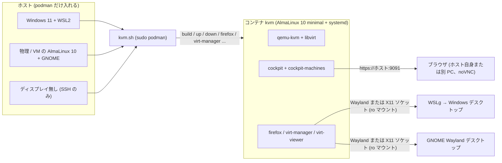

図 1: 利用形態。3 種のホストはいずれも `kvm.sh` 経由で同じコンテナを動かす。画面の出口だけがホスト種別で変わり、
GUI が使えないホストでは cockpit のみを使う。

### 1.2 スコープ外

| 項目 | 理由 (出典) |
| --- | --- |
| WSL2 でのブリッジ接続 (`KVM_BRIDGE`) | Hyper-V 仮想スイッチが WSL の vNIC 以外の MAC からのフレームを破棄する (README「Windows + WSL2 では使えません」、PR 14 の検証) |
| SPICE | RHEL 10 系の qemu-kvm に SPICE が無い。VM のグラフィックスは VNC (README「注意」) |
| cockpit の「ネットワーク」ページ | コンテナ内の NetworkManager をマスクしている (3.4 節) |
| ホストのネットワーク設定の変更 | ブリッジは利用者がホスト側で作る。`kvm.sh` はホストの NIC やブリッジを作らない |
| 自動テスト | テストスイートは無い。検証は README 末尾の確認手順を手で流す (9 章) |

### 1.3 用語

| 用語 | 意味 |
| --- | --- |
| ホスト | `kvm.sh` を実行するマシン (WSL2 ディストリ、物理/VM の AlmaLinux 10、または headless) |
| コンテナ | `kvm.sh up` が起動する podman コンテナ。名前は `kvm` 固定 (`kvm.sh` の変数 `CONTAINER`) |
| イメージ | `localhost/qemu-kvm-cockpit:latest` (`kvm.sh` の変数 `IMAGE`) |
| ホストユーザー | `kvm.sh` を実行した一般ユーザー。`id -un` / `id -u` / `id -g` の値が `HOST_USER` / `HOST_UID` / `HOST_GID` になる |
| GUI ユーザー (= cockpit ユーザー) | コンテナ内でホストユーザーと同じ名前・uid/gid・パスワードハッシュを持つユーザー。GUI アプリの実行者であり、cockpit のログインアカウント |
| テンプレートユーザー `admin` | イメージに焼き込まれた uid 1000 のユーザー。初回起動時に GUI ユーザーへリネームされる |
| ホスト runtime dir | ホストの `$XDG_RUNTIME_DIR` (GNOME: `/run/user/UID`、WSLg: `/mnt/wslg/runtime-dir` への symlink を含む)。コンテナには `/run/host-xdg-runtime` に読み取り専用でマウントされる |
| コンテナ runtime dir | コンテナ内の `/run/user/UID`。コンテナの logind が GUI ユーザー用に作る tmpfs で、ホストとは無関係 |
| ホスト種別 | `wsl` / `generic` / `headless`。`KVM_HOST` で上書きできる (2.1 節) |
| `data/` | リポジトリ直下の永続化ディレクトリ (git 管理外、root 所有)。VM のディスク・定義・GUI ユーザーのホームを保持する |

## 2. 対応環境・前提条件

### 2.1 ホスト種別と判定

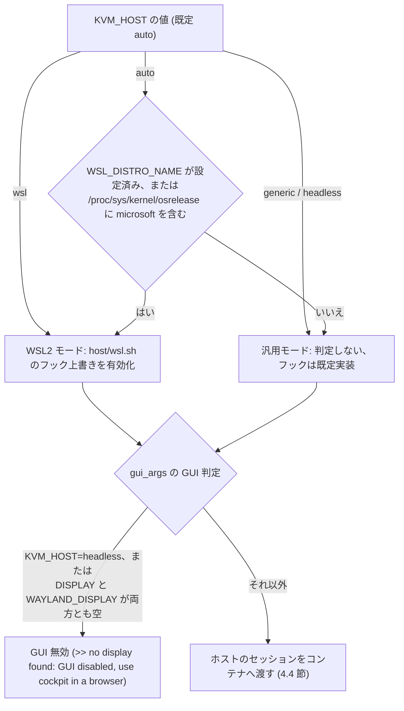

図 2: ホスト種別の判定 (`host/wsl.sh` の `is_wsl`) と GUI 有効/無効の判定 (`kvm.sh` の `gui_args`)。
WSL 判定はフックの上書きだけを決め、GUI の有無は `KVM_HOST=headless` と表示用環境変数の有無で独立に決まる。

| ホスト種別 | 画面表示 | フックの上書き (`host/wsl.sh`) |
| --- | --- | --- |
| `wsl` (Windows 11 + WSL2) | WSLg 経由で Windows デスクトップ | `host_kvm_missing_hint`: `.wslconfig` の `nestedVirtualization=true` を案内。`host_default_runtime_dir`: `XDG_RUNTIME_DIR` 未設定時に `/mnt/wslg/runtime-dir` を使う。`host_force_software_gl`: 常に真 (WSL には `/dev/dri` が無い) |
| `generic` (物理/VM の AlmaLinux 10 + GNOME) | GNOME (Wayland) デスクトップ | 無し。`host_kvm_missing_hint` はファームウェアの SVM/VT-x を案内、`host_default_runtime_dir` は空、`host_force_software_gl` は `/dev/dri` が無いか `KVM_SOFTWARE_GL=1` のとき真 |
| `headless` (ディスプレイ無し) | cockpit の Web コンソール (noVNC) | 無し。`gui_args` が GUI を無効にする |

### 2.2 ホスト要件

| 要件 | 内容 | 確認・処理箇所 |
| --- | --- | --- |
| podman | root で利用 (`sudo podman`)。`kvm.sh` のすべての podman 操作は `PODMAN="sudo podman"` 経由 | `kvm.sh` |
| KVM | CPU 仮想化 (AMD SVM / Intel VT-x)。WSL2 は Windows 側のネストした仮想化。`/dev/kvm` が無ければ `modprobe kvm_amd` (`/proc/cpuinfo` に `AuthenticAMD`) または `kvm_intel` を試み、それでも無ければ `host_kvm_missing_hint` を出して exit 1 | `ensure_kvm` |
| `modprobe` | `/dev/kvm` が無いときに必要。無ければ `!! modprobe not found: sudo dnf install kmod` で exit 1 | `ensure_kvm` |
| WSL | 2.5.1 以降 (cgroup v2 が既定)。`/etc/wsl.conf` の `systemd=true` は不要 (root の podman は cgroupfs で動く) | README |
| デスクトップセッション (GUI を使う場合) | GNOME にログインした端末から実行する。`XDG_RUNTIME_DIR` (WSL では未設定でも可) が実在しなければ `!! XDG_RUNTIME_DIR (...) does not exist. Run this from a terminal inside a desktop session` で exit 1 | `gui_args` |
| SELinux | Enforcing のままで可。本体コンテナは `--privileged` でラベル分離が無効、seed 用コンテナは `--security-opt label=disable` | `kvm.sh up` / `prepare_data_dir` |
| リポジトリの位置 | ユーザーのホーム配下にクローンする。`data/` はその中に作られる (`KVM_DATA_DIR=$PWD/data`) | `kvm.sh` |

### 2.3 実行ユーザーの要件

| 要件 | 振る舞い |
| --- | --- |
| root で実行しない | `host_user_args` が uid 0 を検出すると `!! run kvm.sh as a regular user, not root (the container user mirrors the invoking user)` で exit 1。`install-desktop` / `uninstall-desktop` も root を拒否する |
| `sudo` が使える | `podman`、`getent shadow`、`modprobe`、`chmod /dev/kvm`、`data/` の操作に使う |
| パスワードが設定されている | `sudo getent shadow` のハッシュが空、`!` 始まり、`*` 始まりのいずれかなら `!! USER has no usable password on the host; cockpit login will not work until one is set (passwd), then ./kvm.sh down && ./kvm.sh up` を出すが起動は続行する (cockpit にログインできないだけ) |
| `launch` (Activities から起動) を使う場合 | パスワード無しで `sudo podman` を実行できる sudoers 設定が必要 (`sudo -n` で実行するため。4.7 節) |

### 2.4 起動前に確認されるホスト資源 (`check_host_network`)

| 確認 | 条件 | 結果 |
| --- | --- | --- |
| ブリッジの存在 | `KVM_BRIDGE` が設定され、`/sys/class/net/$KVM_BRIDGE/bridge` が無い | `!! KVM_BRIDGE=... is not a bridge on this host. Create it first (see README: ブリッジ)` で exit 1 |
| `virbr0` の残存 | `/sys/class/net/virbr0` がある | 警告のみ (`!! virbr0 already exists on the host ...` と `sudo ip link del virbr0` の案内)。起動は続くが `default` ネットワークの起動は失敗する |
| cockpit ポートの空き | `ss` があり、`ss -H -ltn "sport = :$COCKPIT_PORT"` が何か返す | `!! port PORT is already in use on the host, so the container's cockpit cannot start.` と `COCKPIT_PORT=9092 ./kvm.sh up` の案内で exit 1 |

## 3. システム構成

### 3.1 全体構成

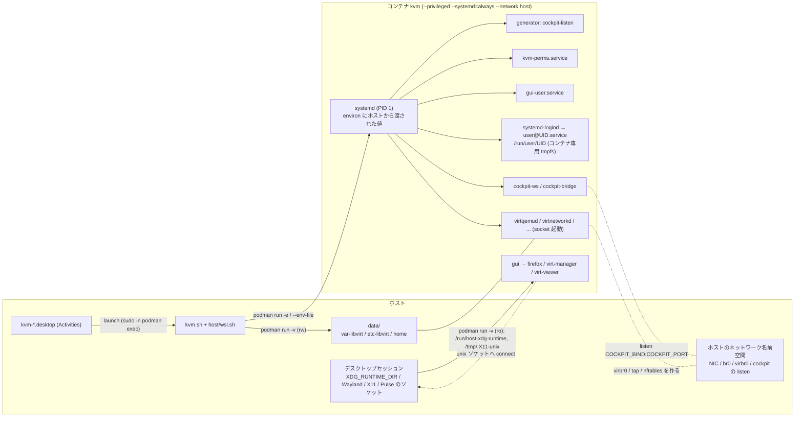

図 3: 全体構成。ホスト → コンテナの値は `podman run` の `-e` / `--env-file` で PID 1 の環境変数になり (4.3 節)、
表示用ソケットは読み取り専用マウントを通して connect する (4.4 節)。ネットワーク名前空間はホストと共有なので、
libvirt のブリッジも cockpit の listen もホスト上に現れる (4.5 節)。

### 3.2 3 層構造とファイル

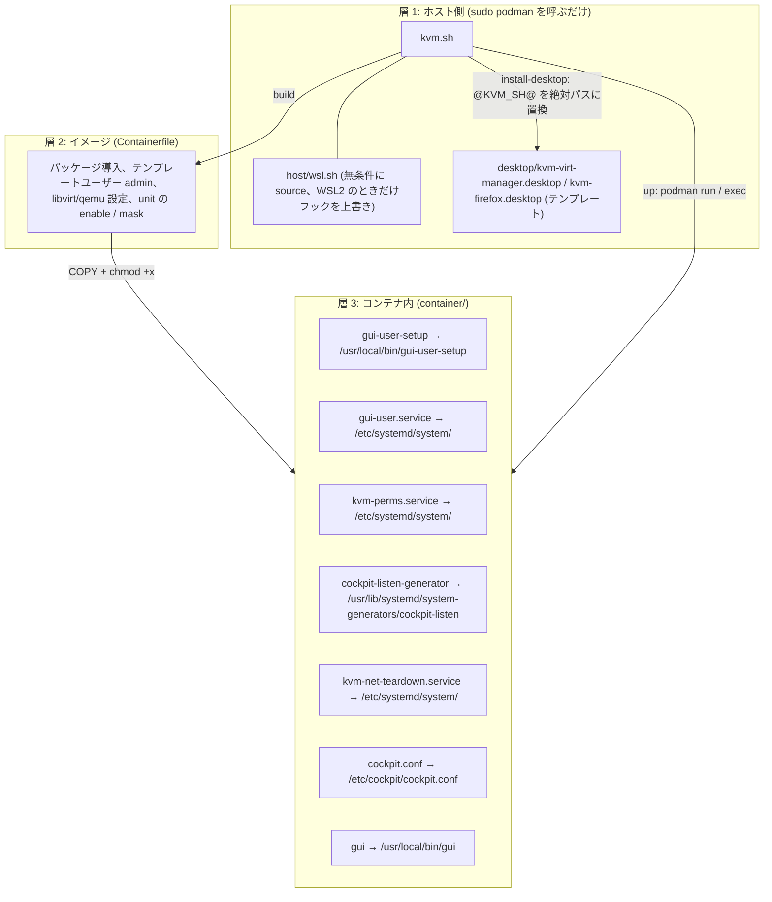

図 4: 3 層構造と Containerfile によるコンテナ内への配置。どの層を触るかで影響範囲が変わる (ホスト側はコンテナを作り直さなくてよい、
イメージと `container/` は `build` が必要)。

| ファイル | 層 | 役割 | 実行タイミング |
| --- | --- | --- | --- |
| `kvm.sh` | ホスト | 操作スクリプト。ホストのセッション環境とユーザー情報を `podman run` の引数に変換する | 利用者が実行 |
| `host/wsl.sh` | ホスト | WSL2 判定と `host_*` フックの上書き | `kvm.sh` が起動直後に source |
| `desktop/kvm-*.desktop` | ホスト | Activities 用ランチャーのテンプレート | `install-desktop` が `~/.local/share/applications/` に配置 |
| `Containerfile` | イメージ | AlmaLinux 10 minimal + `microdnf`。パッケージ、テンプレートユーザー、unit の有効化/マスク | `build` |
| `container/gui-user-setup` + `gui-user.service` | コンテナ | GUI/cockpit ユーザーをホストユーザーに合わせ、linger を有効化 | 起動時 (sysinit、logind より前) |
| `container/kvm-perms.service` | コンテナ | `/dev/kvm` `/dev/net/tun` `/dev/dri/renderD*` の権限と `ip_forward` | 起動時 (sysinit、virtqemud より前) |
| `container/cockpit-listen-generator` | コンテナ | `COCKPIT_LISTEN` を `cockpit.socket` の `ListenStream` に反映 | 起動時 (systemd generator、unit 読み込み前) |
| `container/cockpit.conf` | コンテナ | cockpit-ws の設定 | cockpit-ws 起動時に読まれる |
| `container/kvm-net-teardown.service` | コンテナ | 停止時に libvirt ネットワークを `net-destroy` | 停止時 (`ExecStop`) |
| `container/gui` | コンテナ | GUI ユーザーとしてアプリをホストの画面に起動 | `kvm.sh firefox` / `virt-manager` / `viewer` / `launch` から `podman exec` |

### 3.3 コンテナ実行仕様 (`podman run`)

`kvm.sh up` が発行する `podman run` の引数は次のとおり (順序も同じ)。

| 引数 | 値 | 目的 |
| --- | --- | --- |
| `-d --name kvm --hostname kvm` | 固定 | コンテナ名・ホスト名。`NAME` という変数名は WSL がホスト名に使うため避けている |
| `--privileged` | 固定 | KVM、libvirt、logind、ラベル分離無しのバインドマウント |
| `--systemd=always` | 固定 | `/sbin/init` を PID 1 として動かす |
| `--network host` | 固定 | VM をホストのブリッジに接続できるようにする。帰結は 4.5 節 |
| `--device /dev/kvm --device /dev/net/tun` | 固定 | VM の実行と tap デバイス |
| `-e COCKPIT_LISTEN=<COCKPIT_BIND>:<COCKPIT_PORT>` | 既定 `127.0.0.1:9091` | cockpit の listen アドレス (generator が読む) |
| `-v data/var-libvirt:/var/lib/libvirt` `-v data/etc-libvirt:/etc/libvirt` `-v data/home:/home/<HOST_USER>` | rw | 永続化 (4.6 節) |
| `HOST_ARGS` | `-e HOST_USER= -e HOST_UID= -e HOST_GID=` と `--env-file <mktemp>` | ホストユーザーの写し (4.3 節) |
| `GUI_ARGS` | ro マウントと `-e WAYLAND_DISPLAY/DISPLAY/XAUTHORITY/PULSE_SERVER/HOST_RUNTIME_DIR/LIBGL_ALWAYS_SOFTWARE` | GUI 有効時のみ (4.4 節)。headless では空 |
| `-e TZ=${TZ:-Asia/Tokyo}` | 既定 `Asia/Tokyo` | コンテナのタイムゾーン |
| `--shm-size 2g` | 固定 | 共有メモリ (firefox / qemu 用) |
| イメージ | `localhost/qemu-kvm-cockpit:latest` | |

### 3.4 イメージ仕様 (`Containerfile`)

| 項目 | 値 |
| --- | --- |
| ベース | `quay.io/almalinuxorg/10-minimal:10` (`microdnf`。`--setopt=install_weak_deps=0`、`False/True` は不可) |
| 環境 | `LANG=ja_JP.UTF-8` `LC_ALL=ja_JP.UTF-8` `container=podman` |
| パッケージ方針 | 「依存で入らないものだけ」を列挙する (図 5)。`virt-manager` は EPEL から入れ、無ければ `virt-manager is not available, skipping` で続行 |
| テンプレートユーザー | `admin` (uid 1000、`useradd -m`)。追加グループ `wheel` `libvirt` `video` `render`。パスワードは設定しない (起動時にホストのハッシュを入れる) |
| sudoers | `/etc/sudoers.d/wheel-nopasswd` (0440): `%wheel ALL=(ALL) NOPASSWD: ALL`。グループ指定なのでリネーム後も有効 |
| qemu.conf | `security_driver = "none"`、`namespaces = []` (コンテナ内で動かすための調整) |
| libvirtd.conf | `unix_sock_group = "libvirt"`、`unix_sock_rw_perms = "0770"` |
| tmpfiles | `/etc/tmpfiles.d/x11.conf` → `/dev/null` (ホストの X ソケットを消させない) |
| その他 | `/etc/systemd/system/*.wants/systemd-remount-fs.service` を削除、`EXPOSE 9091`、`STOPSIGNAL SIGRTMIN+3`、`CMD ["/sbin/init"]` |

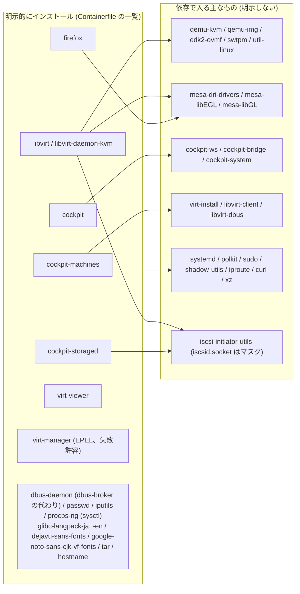

図 5: パッケージの依存関係 (Containerfile のコメントと PR 13 の記録から)。左を明示するだけで右が揃う。
`procps-ng` は弱い依存でしか引かれないため `kvm-perms.service` の `sysctl` 用に明示している。

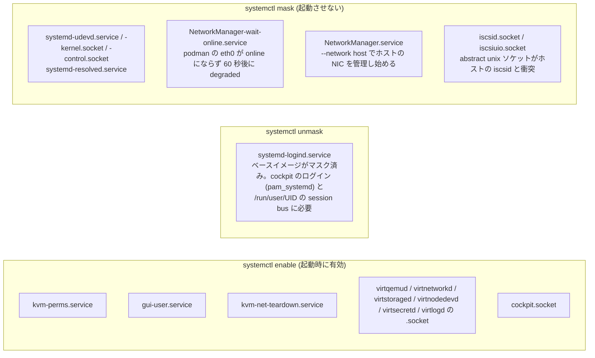

図 6: コンテナ内 systemd unit の状態。マスクの理由は `--network host` (m3, m4)、podman のネットワーク判定 (m2) に由来する。
`systemd-udevd` / `systemd-resolved` は Containerfile に個別の理由が書かれていない (コンテナ内で動かさない unit)。

## 4. 外部インターフェース仕様

### 4.1 CLI (`kvm.sh <サブコマンド>`)

`kvm.sh` は `set -euo pipefail` で動き、最初に自分のディレクトリへ `cd` する (すべての相対パスはリポジトリ直下基準)。
引数無し、または未知のサブコマンドではヘッダコメント (2〜20 行目) を usage として表示する。

| サブコマンド | 引数 | 前提 | 動作 | 終了 |
| --- | --- | --- | --- | --- |
| `build` | 追加の `podman build` 引数 | | `podman build -t localhost/qemu-kvm-cockpit:latest -f Containerfile "$@" .` | podman の終了コード |
| `up` | 無し | 2 章の要件 | 5.1 節の起動シーケンス。既に起動中なら `>> kvm is already running` | 準備が整えば 0。30 秒で確認できなければ `!! could not confirm startup. Check systemctl --failed via ./kvm.sh shell` で 1 |
| `down` | 無し | | `podman rm -f -t 10 kvm` (5.2 節)。`data/` は残る | podman の終了コード |
| `clean` | 無し | | コンテナを削除 (失敗は無視) → `data/` が無ければ `>> ... does not exist` で 0 → 削除対象と `du -sh` を表示 → `KVM_CLEAN_YES=1` でなければ `This deletes the VM disks and definitions as well. Continue? [y/N]` を尋ね、`y`/`Y` 以外は `>> aborted` で 1 → `sudo rm -rf data/` | 上記 |
| `firefox` / `virt-manager` | 追加引数 (アプリへ渡す) | GUI 有効で起動したコンテナ | 未起動なら `up` を実行してから `podman exec kvm gui <app> "$@"` | `gui` の終了コード (headless なら 2) |
| `viewer <VM名>` | VM 名 (virt-viewer の引数) | 同上 | 未起動なら `up`、`podman exec kvm gui virt-viewer "$@"` | 同上 |
| `virsh ...` | virsh の引数 | 起動中 | `podman exec -it kvm virsh -c qemu:///system "$@"` | virsh の終了コード |
| `shell` | 無し | 起動中 | `podman exec -it kvm bash` | bash の終了コード |
| `logs` | 無し | 起動中 | `/var/log/gui.log` の末尾 50 行と `journalctl -n 30 -u virtqemud -u cockpit.socket -u gui-user` | |
| `launch <app>` | `firefox` または `virt-manager` | `.desktop` から呼ばれる。podman の NOPASSWD sudo | `sudo -n podman exec kvm gui <app>` を実行し、失敗をデスクトップ通知にする (4.7 節)。他の引数は usage を出して 1 | 成功 0 / 失敗 1 |
| `install-desktop` | 無し | root 以外、デスクトップにログインしたユーザー | イメージが無ければ `build`。アイコン抽出と `.desktop` 配置 (4.7 節) | 0 |
| `uninstall-desktop` | 無し | root 以外 | `.desktop` とアイコンを削除 | 0 |

### 4.2 環境変数 (ホスト側の入力)

`kvm.sh` が利用者から受け取る変数:

| 変数 | 既定 | 意味 | 読む場所 |
| --- | --- | --- | --- |
| `KVM_HOST` | `auto` | ホスト種別の上書き (`wsl` / `generic` / `headless`)。`headless` は GUI を無効にする | `host/wsl.sh` `is_wsl`、`gui_args` |
| `COCKPIT_BIND` | `127.0.0.1` | cockpit の bind アドレス。`0.0.0.0` / `::` で他 PC から到達可 | `COCKPIT_LISTEN` の組み立て、ready メッセージ |
| `COCKPIT_PORT` | `9091` | cockpit のポート。9090 でないのはホスト自身の cockpit と衝突するため | 同上、`check_host_network` |
| `KVM_BRIDGE` | 未設定 | ホストの既存ブリッジ名。libvirt ネットワーク `bridged` として登録する。未設定なら `bridged` を削除 | `check_host_network`、`sync_bridged_network` |
| `KVM_SOFTWARE_GL` | 未設定 | `1` でソフトウェア描画を強制 (`LIBGL_ALWAYS_SOFTWARE=1`) | `host_force_software_gl` |
| `TZ` | `Asia/Tokyo` | コンテナのタイムゾーン | `podman run -e TZ` |
| `KVM_CLEAN_YES` | 未設定 | `1` で `clean` の確認を省略 | `clean` |

セッションから読む変数 (GUI 有効時):

| 変数 | 用途 |
| --- | --- |
| `XDG_RUNTIME_DIR` | ホスト runtime dir。未設定なら `host_default_runtime_dir` (WSL: `/mnt/wslg/runtime-dir`、それ以外: 空 → エラー) |
| `WAYLAND_DISPLAY` | Wayland ソケット。相対名は runtime dir 基準。ソケットでなければ警告して Wayland を無効化 |
| `DISPLAY` | X11。設定されていれば `/tmp/.X11-unix` (realpath) を ro マウントする |
| `XAUTHORITY` | 設定されていて読めれば、コンテナ内パスに変換して渡す |
| `PULSE_SERVER` | 未設定なら `$XDG_RUNTIME_DIR/pulse/native` がソケットのときに `unix:` 形式で補う。`unix:` 以外はそのまま渡す。ソケットでなければ `audio disabled` |
| `XDG_DATA_HOME` / `HOME` | `install-desktop` の配置先 (`${XDG_DATA_HOME:-$HOME/.local/share}`) |
| `WSL_DISTRO_NAME` | WSL2 判定 |

### 4.3 ホスト → コンテナの値の受け渡し

コンテナ内のスクリプトは、`podman run` で渡された値を **PID 1 (systemd) の環境** から `tr` で NUL を改行に変換して
`/proc/1/environ` を読むことで取得する。`podman exec` で起動するプロセス (`gui`) には同じ値が環境変数として継承される。

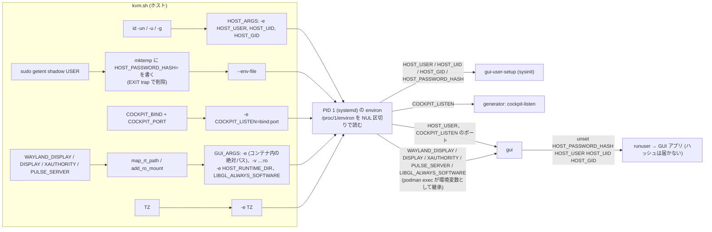

図 7: 値の流れ。パスワードハッシュだけは `--env-file` (コマンドラインに出さない) で渡し、`gui` が `runuser` の前に `unset` する。

| 変数 | 渡し方 | 値 | 読む側 |
| --- | --- | --- | --- |
| `HOST_USER` `HOST_UID` `HOST_GID` | `-e` | `id -un` / `id -u` / `id -g` | `gui-user-setup` (全部)、`gui` (`HOST_USER`) |
| `HOST_PASSWORD_HASH` | `--env-file` (mktemp、EXIT trap で削除) | `sudo getent shadow` の第 2 フィールド。使えないハッシュのときは渡さない | `gui-user-setup` |
| `COCKPIT_LISTEN` | `-e` | `<COCKPIT_BIND>:<COCKPIT_PORT>` | `cockpit-listen-generator`、`gui` (firefox の URL 用にポート部分) |
| `HOST_RUNTIME_DIR` | `-e` (GUI 時) | `/run/host-xdg-runtime` | `gui` (Xauthority の探索) |
| `WAYLAND_DISPLAY` `DISPLAY` `XAUTHORITY` `PULSE_SERVER` | `-e` (GUI 時、存在するものだけ) | コンテナ内から見た絶対パス (`PULSE_SERVER` は `unix:` 付き、`DISPLAY` はホストの値そのまま) | `gui` → GUI アプリ |
| `LIBGL_ALWAYS_SOFTWARE` | `-e` (条件付き) | `1` (`host_force_software_gl` が真のとき) | `gui` → GUI アプリ |
| `TZ` | `-e` | `${TZ:-Asia/Tokyo}` | コンテナ全体 |

新しい値を渡すときもこの流儀 (`-e` で渡し、PID 1 の environ から読む) に合わせる。

### 4.4 マウント仕様と表示の仕組み

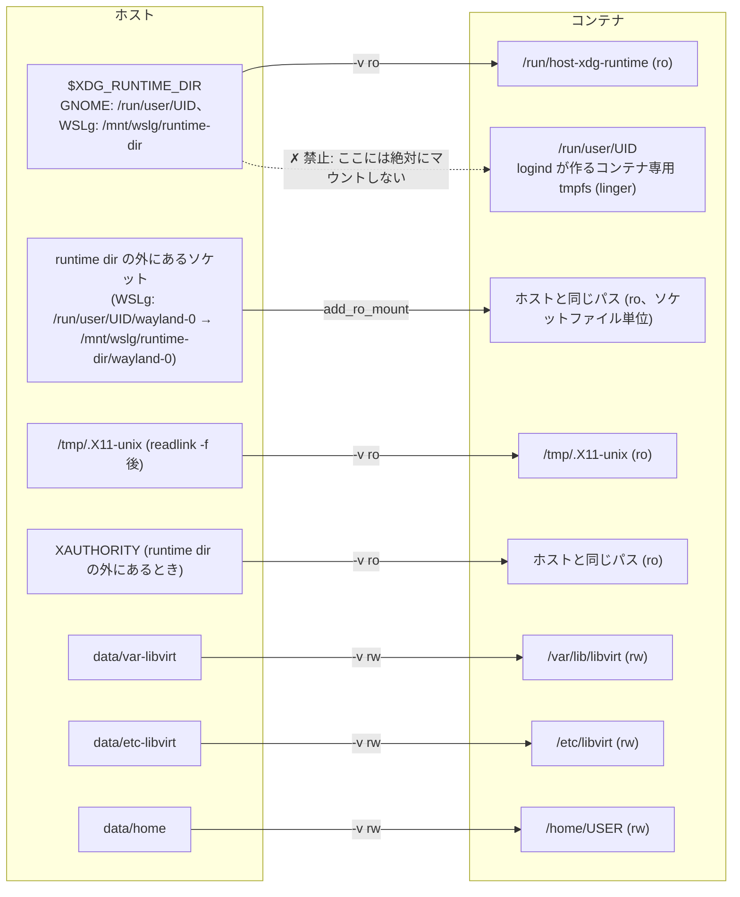

図 8: ホストのパスとコンテナ内パスの対応。ホストの runtime dir は別パスに読み取り専用でマウントし、
コンテナの `/run/user/UID` はコンテナの logind のものにする。この 2 つを混ぜないことが最重要の不変条件 (6 章)。

| ホスト | コンテナ | モード | 条件 | 目的 |
| --- | --- | --- | --- | --- |
| `data/var-libvirt` | `/var/lib/libvirt` | rw | 常に | ディスクイメージ、ISO |
| `data/etc-libvirt` | `/etc/libvirt` | rw | 常に | VM 定義、ネットワーク定義、qemu.conf |
| `data/home` | `/home/<HOST_USER>` | rw | 常に | firefox プロファイル等 |
| `$XDG_RUNTIME_DIR` | `/run/host-xdg-runtime` | ro | GUI 有効 | Wayland / Xwayland 認証 / Pulse のソケットに届くため。unix ソケットは ro でも connect できる |
| `readlink -f /tmp/.X11-unix` | `/tmp/.X11-unix` | ro | `DISPLAY` 設定時 | X11 フォールバック。ro にするのは systemd-tmpfiles にホストの X ソケットを消させないため |
| runtime dir 外のソケット (Wayland / Pulse) | 同じパス | ro | `map_rt_path` が失敗したとき | ソケットファイルだけをマウントする。親ディレクトリ (`/tmp` や `$HOME`) はマウントしない (コンテナ側のディレクトリを隠すため) |
| runtime dir 外の `XAUTHORITY` | 同じパス | ro | 同上 | `add_ro_mount` を通さず直接 `-v` (重複チェック無し) |

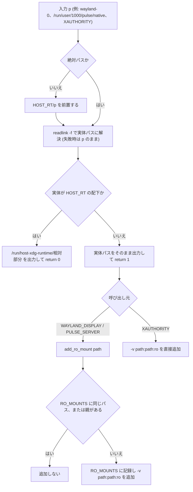

図 9: `map_rt_path` の変換規則と、runtime dir 外だったときの処理。WSLg の `/run/user/UID/wayland-0` は
`/mnt/wslg/runtime-dir/wayland-0` への symlink なので後者の経路を通る。

`gui_args` の出力 (環境変数として `gui` に届く値):

| 条件 | 環境変数 | 値 |
| --- | --- | --- |
| GUI 有効 | `HOST_RUNTIME_DIR` | `/run/host-xdg-runtime` |
| `WAYLAND_DISPLAY` がソケット | `WAYLAND_DISPLAY` | 絶対パス (libwayland 1.15 以降が受け付ける)。ソケットでなければ `!! WAYLAND_DISPLAY=... is not a socket (...); Wayland disabled, X11 is used if DISPLAY is set` |
| `DISPLAY` 設定、`/tmp/.X11-unix` がディレクトリ | `DISPLAY` | ホストの値そのまま |
| 上に加えて `XAUTHORITY` が読める | `XAUTHORITY` | 変換後のパス |
| Pulse ソケットあり | `PULSE_SERVER` | `unix:<変換後のパス>`。`unix:` 以外の値は無変換 |
| `host_force_software_gl` が真 | `LIBGL_ALWAYS_SOFTWARE` | `1` |

### 4.5 ネットワークとポート

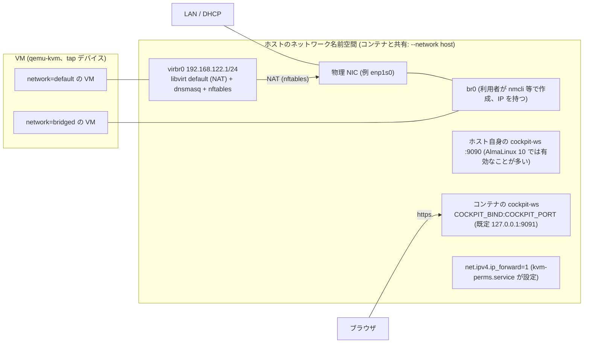

図 10: ネットワーク。コンテナ専用の名前空間は無く、libvirt が作るもの (virbr0、dnsmasq、nftables) も cockpit の listen も
ホスト上に現れる。`bridged` は `<forward mode="bridge"/>` で VM の tap をホストの `br0` に直接つなぐ。

| 項目 | 仕様 |
| --- | --- |
| cockpit の listen | `COCKPIT_LISTEN` から generator が `cockpit.socket` の `ListenStream=` を書き換える。bare な IPv6 リテラル (`::`) は `[::]` に整形する。既定 (未指定時) は `127.0.0.1:9091` |
| ポート 9091 の理由 | AlmaLinux 10 のホストは自前の `cockpit.socket` が 9090 を使っていることが多く、`--network host` では衝突する。`check_host_network` が使用中のポートを検出して中止する |
| 外部公開 | `COCKPIT_BIND=0.0.0.0` (または `::`) のとき ready メッセージが `https://$(uname -n):PORT` と `sudo firewall-cmd --add-port=PORT/tcp --permanent && sudo firewall-cmd --reload` を案内する (firewalld の `cockpit` サービスは 9090 固定なので使えない) |
| `default` ネットワーク | libvirt 標準の NAT (`virbr0`、192.168.122.0/24)。ホストで libvirt が動いていると衝突する (`virbr0` 検出で警告) |
| `bridged` ネットワーク | `KVM_BRIDGE` 指定時に `sync_bridged_network` が define/autostart/start する (5.7 節)。定義は `data/etc-libvirt` に永続化され、`KVM_BRIDGE` 無しで `up` すると削除される |
| ip_forward | `kvm-perms.service` が `net.ipv4.ip_forward=1` をホストの名前空間に設定する |
| 停止時 | `kvm-net-teardown.service` が全ネットワークを `net-destroy` し、残った `virbr*` を `ip link del` する (5.2 節) |

### 4.6 永続化データ (`data/`)

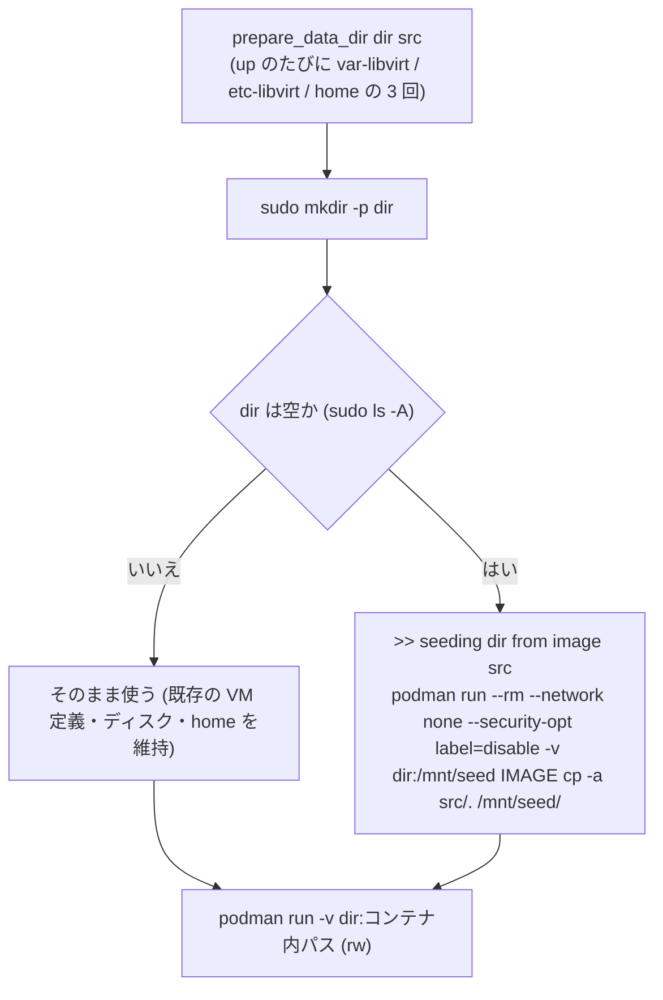

図 11: `data/` の初期化。バインドマウントは named volume と違い初回にイメージ側の内容をコピーしないので、
空のときだけ一時コンテナで `cp -a` する。seed 元は `/var/lib/libvirt` `/etc/libvirt` `/home/admin` (テンプレートユーザーのホーム)。

| 項目 | 仕様 |
| --- | --- |
| 場所 | `<リポジトリ>/data/` (`KVM_DATA_DIR=$PWD/data`)。`.gitignore` で `data/` `*.iso` `*.qcow2` `build.log` を除外 |
| 所有者 | `sudo podman` で動くため root や qemu 所有。ホストから読み書きするには `sudo` が必要 |
| SELinux | 本体コンテナは `--privileged` なので `:Z` 等のラベル付けは不要。seed コンテナは `container_t` のままだと `user_home_t` の `data/` に書けないため `--security-opt label=disable` を付ける |
| `data/home` | コンテナ内 `/home/<HOST_USER>` にマウントされ、`gui-user-setup` が `chown -R HOST_UID:HOST_GID` する |
| 削除 | `clean` のみ (`down` では残る)。パスワード変更やユーザー変更の反映は `down` → `up` |

### 4.7 デスクトップ統合 (Activities からの起動)

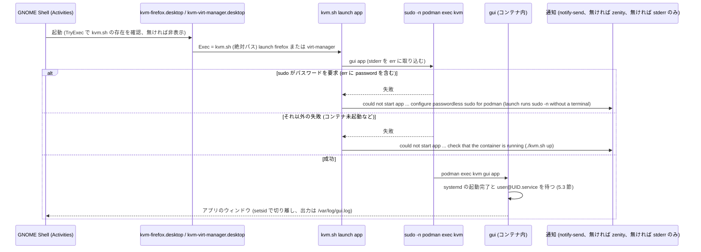

図 12: `.desktop` からの起動経路。端末が無く sudo のパスワードを入力できないため `sudo -n` を使い、失敗理由はデスクトップ通知で伝える。

| 項目 | 仕様 |
| --- | --- |
| 配置先 | `${XDG_DATA_HOME:-$HOME/.local/share}/applications/kvm-virt-manager.desktop`、`kvm-firefox.desktop`。アイコンは同 `icons/hicolor/<size>/apps/{virt-manager,firefox}.*` |
| テンプレート置換 | `desktop/kvm-<app>.desktop` の `@KVM_SH@` を `<リポジトリ>/kvm.sh` (絶対パス) に置換 (`sed`)。リポジトリを移動したら再実行が必要 |
| `.desktop` の主要キー | `TryExec=@KVM_SH@` (無ければエントリ非表示)、`Exec="@KVM_SH@" launch <app>`、`Icon=firefox` / `virt-manager`、`StartupWMClass=firefox` / `virt-manager`、`Terminal=false`、`Name[ja]` / `Comment[ja]` / `Keywords` の日本語 |
| アイコン抽出 | 一時コンテナ (`--rm --network none`) で `/usr/share/icons/hicolor` から `apps/virt-manager.*` と `apps/firefox.*` だけを `tar` で取り出す。失敗しても続行 (汎用アイコンになる旨を表示) |
| virt-manager 不在 | イメージに `/usr/bin/virt-manager` が無ければ `>> virt-manager is not in the image; skipping kvm-virt-manager.desktop` |
| 後処理 | `update-desktop-database -q` (あれば)。配置先と Activities での検索語を表示 |
| `launch` の前提 | 実行ユーザーが `sudo -n podman` を実行できること。`launch` は `firefox` / `virt-manager` 以外を拒否する |
| 通知 | `notify-send -a kvm.sh -i dialog-error "kvm-container" "<本文>"` → 無ければ `zenity --error --title=kvm-container --text=<本文>` → どちらも無ければ stderr のみ |
| 解除 | `uninstall-desktop` が `.desktop` 2 つと `icons/hicolor/*/apps/{virt-manager,firefox}.*` を削除 |

### 4.8 ログとメッセージの規約

| 出力元 | 形式 | 出力先 |
| --- | --- | --- |
| `kvm.sh` の進捗 | `>> ...` | stdout |
| `kvm.sh` の警告・エラー | `!! ...` (続きの行は 3 スペースのインデント) | stderr |
| `gui-user-setup` | `gui-user: ...` (エラーは `gui-user: ERROR ...`) | journal (`gui-user.service`) |
| `gui` 自身の警告 | `gui: ...`、headless は `!! GUI unavailable ...` | `podman exec` の stderr (`launch` 経由ではデスクトップ通知に含まれる) |
| GUI アプリの stdout/stderr | アプリの出力そのまま | コンテナ内 `/var/log/gui.log` (追記) |
| `kvm.sh logs` | `gui.log` 末尾 50 行 + `journalctl -n 30 -u virtqemud -u cockpit.socket -u gui-user` | stdout |

## 5. 内部仕様 (処理シーケンス)

### 5.1 起動シーケンス (`kvm.sh up`)

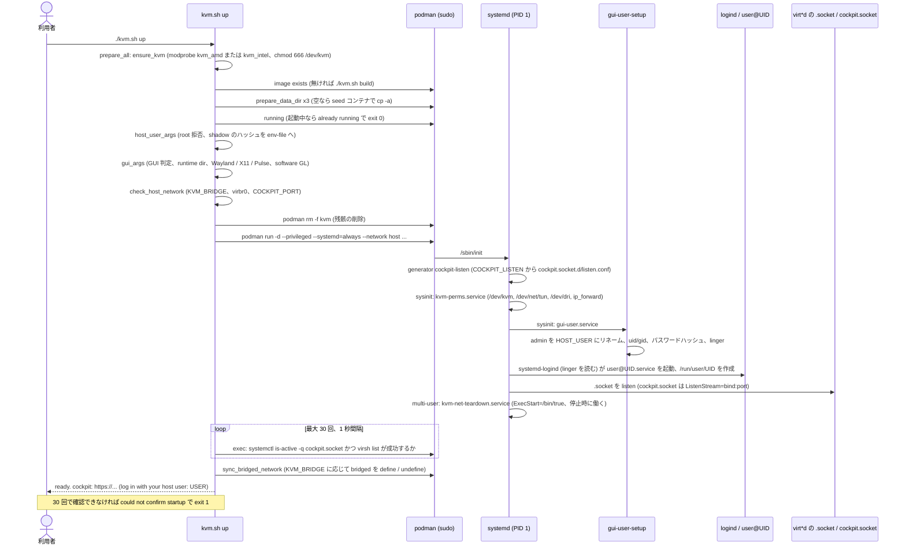

図 13: 起動シーケンス。ホスト側の準備 (KVM、イメージ、`data/`、ユーザー、セッション、ネットワーク) → コンテナ起動 →
コンテナ内の systemd による初期化 → ホスト側からの readiness 確認 → ブリッジ同期、の順。

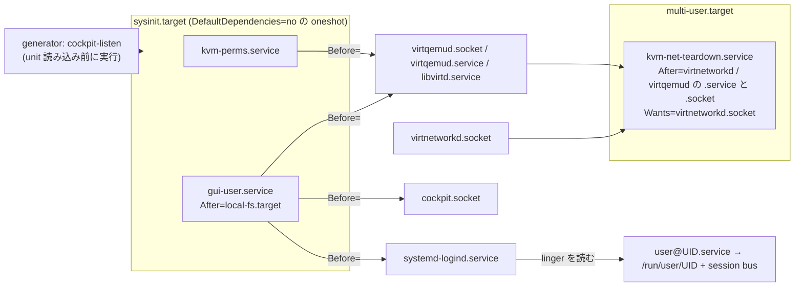

図 14: コンテナ内 unit の順序関係 (`Before=` / `After=` / `WantedBy=` から)。`gui-user.service` が logind より前なのは、
logind が `/var/lib/systemd/linger` を起動時にしか読まないため。`kvm-net-teardown` が virt*d の後なのは停止時に先に止まるため。

起動後の ready メッセージ:

| 条件 | 出力 |
| --- | --- |
| `COCKPIT_BIND` が `0.0.0.0` または `::` | `>> ready. cockpit: https://$(uname -n):PORT  (log in with your host user: USER)` と firewalld の `--add-port` 案内 |
| それ以外 | `>> ready. cockpit: https://COCKPIT_BIND:PORT  (log in with your host user: USER)` |
| GUI 有効 (`GUI_ARGS` が空でない) | 追加で `>> host display: ./kvm.sh firefox \| ./kvm.sh virt-manager` |

### 5.2 停止シーケンス (`kvm.sh down`)

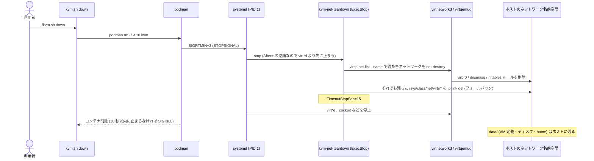

図 15: 停止シーケンス。`virbr0` はホストの名前空間にあるため、コンテナが消えても自動では消えない。libvirt のデーモンが
生きているうちに `net-destroy` し、idle-exit していて socket activation が拒否される場合に備えて `ip link del` も行う。

### 5.3 GUI 起動シーケンス (`container/gui`)

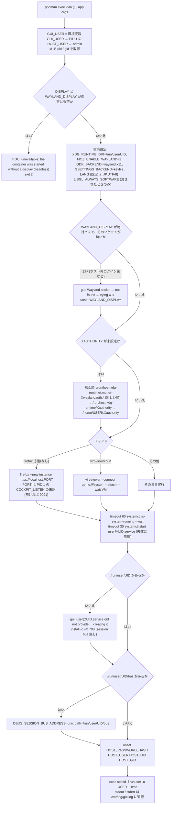

図 16: `gui` の処理。GUI アプリは **コンテナの** `/run/user/UID` と session bus を使い (virt-manager の単一インスタンス化に必要)、
ホストの runtime dir はソケットへの connect にだけ使う。`runuser` は `--login` 無しなので環境がそのまま渡り、そのために秘密を先に `unset` する。

### 5.4 ユーザー同期 (`gui-user-setup`)

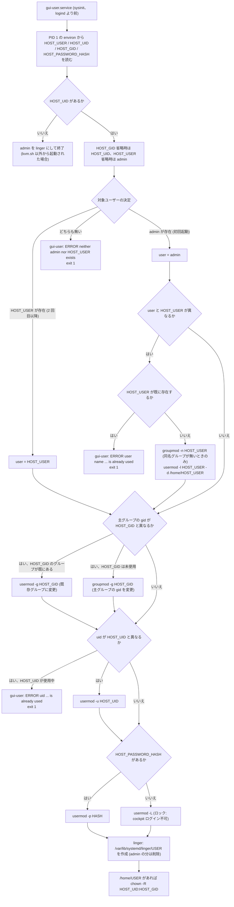

図 17: ユーザー同期。初回はテンプレート `admin` をリネームし、コンテナを作り直さずに再起動した場合 (`kvm.sh up` は毎回 `podman rm` してイメージから作るので、
`podman restart` などに限る) はリネーム済みユーザーを対象にする。linger は `loginctl enable-linger` と同じ効果を
logind 起動前に得るため、ファイルを直接作る。

### 5.5 各 unit と設定の仕様

| unit / ファイル | 種別 | 依存関係 | 内容 |
| --- | --- | --- | --- |
| `gui-user.service` | oneshot, RemainAfterExit | `DefaultDependencies=no`、`After=local-fs.target`、`Before=systemd-logind.service cockpit.socket virtqemud.socket`、`WantedBy=sysinit.target` | `ExecStart=/usr/local/bin/gui-user-setup` (5.4 節) |
| `kvm-perms.service` | oneshot, RemainAfterExit | `DefaultDependencies=no`、`Before=virtqemud.socket virtqemud.service libvirtd.service`、`WantedBy=sysinit.target` | `chmod 0666 /dev/kvm /dev/net/tun`、`chown root:kvm /dev/kvm`、`chmod 0666 /dev/dri/renderD*`、`sysctl -qw net.ipv4.ip_forward=1`。すべて失敗を無視 (`\|\| true`) |
| `kvm-net-teardown.service` | oneshot, RemainAfterExit | `After=virtnetworkd.service virtqemud.service virtnetworkd.socket virtqemud.socket`、`Wants=virtnetworkd.socket`、`WantedBy=multi-user.target`、`TimeoutStopSec=15` | `ExecStart=/bin/true`、`ExecStop` で全ネットワークの `net-destroy` と `virbr*` の `ip link del` (5.2 節) |
| `cockpit-listen` (generator) | systemd generator (`/usr/lib/systemd/system-generators/`) | unit 読み込み前 | 第 1 引数 (normal ディレクトリ) に `cockpit.socket.d/listen.conf` を生成: `ListenStream=` (リセット) と `ListenStream=<bind>:<port>`。`COCKPIT_LISTEN` が無ければ `127.0.0.1:9091` |
| `cockpit.conf` | cockpit-ws 設定 | | `[WebService]` `AllowUnencrypted = true`、`ProtocolHeader = X-Forwarded-Proto` (Origin は Host ヘッダで検査されるので localhost でも他 PC でも動く) |
| `systemd-logind.service` | (unmask) | | cockpit ログインで pam_systemd がセッションを作り、`/run/user/UID/bus` を使う。無いと cockpit-bridge が落ちてログイン直後にログアウトされる |

### 5.6 ホスト種別フック (`host_*`)

`kvm.sh` はホスト依存の振る舞いを 3 つのフック関数として汎用実装付きで定義し、その直後に `host/wsl.sh` を無条件に source する。
`host/wsl.sh` は WSL2 のときだけ同名関数を再定義する。`kvm.sh` 本体には WSL 固有の分岐や文字列を書かない。

| フック | 引数 / 戻り値 | 汎用実装 (`kvm.sh`) | WSL2 実装 (`host/wsl.sh`) | 呼び出し元 |
| --- | --- | --- | --- | --- |
| `host_kvm_missing_hint` | 無し / stderr にメッセージ | `!! /dev/kvm not found. Enable SVM (AMD) / VT-x (Intel) in the firmware and check sudo modprobe kvm_amd or kvm_intel` | `!! /dev/kvm not found. Set [wsl2] nestedVirtualization=true in %USERPROFILE%\.wslconfig on the Windows side and run wsl --shutdown` | `ensure_kvm` (modprobe 後も `/dev/kvm` が無いとき) |
| `host_default_runtime_dir` | 無し / stdout にパス | 何も出力しない | `/mnt/wslg/runtime-dir` | `gui_args` (`XDG_RUNTIME_DIR` 未設定時) |
| `host_force_software_gl` | 無し / 終了コード (0 = 強制) | `[ ! -d /dev/dri ] \|\| [ "$KVM_SOFTWARE_GL" = 1 ]` | 常に 0 (WSL に `/dev/dri` は無い) | `gui_args` (`LIBGL_ALWAYS_SOFTWARE=1` を付けるか) |

新しいホスト依存の挙動はこの形式で追加する (汎用実装を `kvm.sh` に、上書きを `host/wsl.sh` に)。

### 5.7 ブリッジ同期 (`sync_bridged_network`)


図 18: `bridged` ネットワークの同期。ブリッジ自体の存在は起動前に `check_host_network` が確認済み。毎回 define し直すので、
`KVM_BRIDGE` の値を変えるとその値に追従する。

## 6. 設計上の不変条件

以下はいずれも実際の不具合を踏んだ結果その形になっている (付録 B の PR 番号)。理由を理解せずに変えないこと。

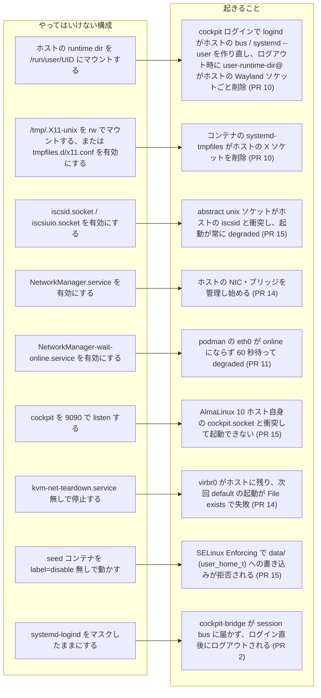

図 19: 禁止構成とその帰結。左の構成にすると右の不具合が再発する。

| 規則 | 実装箇所 | 補足 |
| --- | --- | --- |
| ホストの `XDG_RUNTIME_DIR` は `/run/host-xdg-runtime` に **読み取り専用** でマウントし、`/run/user/UID` には絶対にマウントしない | `kvm.sh` `gui_args` / `HOST_RUNTIME_DIR` | ソケットは `map_rt_path` でコンテナ内の絶対パスに変換して環境変数で渡す。runtime dir 外の symlink 先はそのファイルだけを同じパスに ro マウント |
| コンテナ内の `/run/user/UID` は logind が作る tmpfs。GUI ユーザーを linger にして起動時から存在させる | `gui-user-setup` `enable_linger`、`gui-user.service` の `Before=systemd-logind.service` | cockpit ログアウトでも消えない。`gui` はこれを `XDG_RUNTIME_DIR` にする |
| `/tmp/.X11-unix` は読み取り専用マウント、`tmpfiles.d/x11.conf` はマスク | `kvm.sh` `gui_args`、`Containerfile` | コンテナの systemd-tmpfiles にホストの X ソケットを消させない |
| `--network host` の帰結を守る: 既定ポート 9091、`iscsid.socket` / `iscsiuio.socket` / `NetworkManager.service` / `NetworkManager-wait-online.service` のマスク、停止時の `kvm-net-teardown` | `kvm.sh` `COCKPIT_PORT` / `check_host_network`、`Containerfile`、`kvm-net-teardown.service` | `podman -p` は使えないので generator で `ListenStream` を書き換える |
| GUI/cockpit ユーザーはホストユーザーの写し (名前・uid/gid・パスワードハッシュ)。`kvm.sh` は root で実行させない | `host_user_args`、`gui-user-setup` | ホストの runtime dir は 0700 なので uid 一致が必要。cockpit はコンテナの `/etc/shadow` で認証する |
| `data/` は空のときだけ seed し、seed コンテナは `--security-opt label=disable` | `prepare_data_dir` | バインドマウントはイメージの内容をコピーしないため |
| `systemd-logind` はマスク解除する | `Containerfile` | ベースイメージはマスク済み。cockpit の pam_systemd と session bus に必要 |
| ホスト → コンテナの値は PID 1 の environ 経由。パスワードハッシュだけは `--env-file`、`gui` は `runuser` 前に `unset` | `kvm.sh`、`gui-user-setup` `env_of_pid1`、`gui` | 新しい値もこの流儀で渡す |
| コンテナ名は `kvm` 固定 (変数名 `CONTAINER`)。`NAME` は使わない | `kvm.sh` | `NAME` は WSL がホスト名に使う |
| ホスト依存の挙動は `host_*` フックで足す。`kvm.sh` 本体に WSL 分岐を書かない | `kvm.sh`、`host/wsl.sh` | 5.6 節 |

## 7. セキュリティ考慮事項

| 項目 | 現状の扱い | 影響 |
| --- | --- | --- |
| コンテナの権限 | `--privileged`、root の podman、`--network host`。SELinux のラベル分離は無効 | コンテナ内 root はホスト root と同等。信頼できるイメージ (このリポジトリの `build`) のみ使う前提 |
| ホストユーザーのパスワードハッシュ | `sudo getent shadow` で取得 → `mktemp` のファイルに書く (`mktemp` の既定は 0600) → `podman run --env-file` で渡す (コマンドラインには出ない) → `kvm.sh` 終了時に EXIT trap で削除。コンテナ内では PID 1 の environ と `podman exec` の環境に存在するため、`gui` は `runuser` の前に `unset` する | ハッシュはコンテナ内 root (PID 1 の environ、`/etc/shadow`) から読める。GUI アプリのプロセス環境には残らない |
| cockpit の TLS | 自己署名証明書 (cockpit-ws の既定)。`AllowUnencrypted = true`、`ProtocolHeader = X-Forwarded-Proto` | ブラウザで警告が出る。既定 bind は `127.0.0.1` なのでホスト外からは届かない |
| `COCKPIT_BIND=0.0.0.0` / `::` | ホストの全アドレスで listen。認証はホストユーザーの名前・パスワード (コンテナ内 `/etc/shadow`) | ホストユーザーの資格情報が LAN から試行可能になる。firewalld の開放は利用者が行う |
| コンテナ内の sudo | `%wheel ALL=(ALL) NOPASSWD: ALL`。GUI ユーザーは `wheel` に属する | cockpit の「管理者アクセス」に使う。コンテナ内では GUI ユーザー = root 相当 |
| ホスト側の sudo | `launch` (Activities 起動) だけが `sudo -n podman` を要求する。通常の `kvm.sh` は対話的な `sudo` | podman の NOPASSWD sudo はホスト root 相当の権限付与になる。設定は利用者の判断 |
| libvirt / qemu | `security_driver = "none"`、`namespaces = []`。`/dev/kvm` `/dev/net/tun` は 0666、`/dev/dri/renderD*` も 0666 | VM 間の SELinux / namespace 隔離は無い |
| ホストのセッション資源 | runtime dir と `/tmp/.X11-unix` は読み取り専用。Xauthority も ro | GUI アプリはホストのコンポジタに接続できる (画面・入力にアクセス可能) が、ホストのソケットを消したり作り直したりはできない |
| `data/` | root / qemu 所有。`clean` で削除 (確認あり、`KVM_CLEAN_YES=1` で省略) | VM ディスクと定義はホストのファイルシステムに平文で置かれる |

## 8. 既知の制限事項

| 制限 | 内容 |
| --- | --- |
| WSL2 でブリッジ不可 | Hyper-V 仮想スイッチが WSL の vNIC 以外の MAC からのフレームを破棄する。WSL2 では `default` (NAT) を使う |
| SPICE 非対応 | RHEL 10 系の qemu-kvm に SPICE が無く、VM のグラフィックスは VNC |
| cockpit の「ネットワーク」ページ | コンテナ内の NetworkManager がマスクされているため使えない |
| ホストの再ログイン | GNOME からログアウト/再ログインすると `/run/user/UID` が作り直され、コンテナに渡した Wayland ソケットのパスが無効になる。`gui` は X11 にフォールバックを試みるが、`./kvm.sh down` → `./kvm.sh up` が必要。`DISPLAY` 等を変えた場合も同様 |
| パスワード変更の反映 | ホストでパスワードを変えても起動中のコンテナには反映されない。`down` → `up` |
| headless での GUI | `kvm.sh firefox` 等は `gui` が exit 2 で失敗する。cockpit をブラウザで使う |
| virt-manager | EPEL に無い環境ではイメージに入らず、`install-desktop` は `.desktop` をスキップする |
| WSLg のスタートメニュー | `~/.local/share/applications` の `.desktop` は Windows のスタートメニューに反映されるはずだが未検証 |
| 検証の範囲 | 物理 AlmaLinux 10 での cockpit ログイン (パスワード未設定のため) と `KVM_BRIDGE` (無線 NIC のため) は PR 15 時点で未確認。ハッシュのコピーまでは確認済み |
| 起動確認のタイムアウト | readiness は 30 秒固定。遅いホストでは `could not confirm startup` になり得る (コンテナ自体は起動を続ける) |

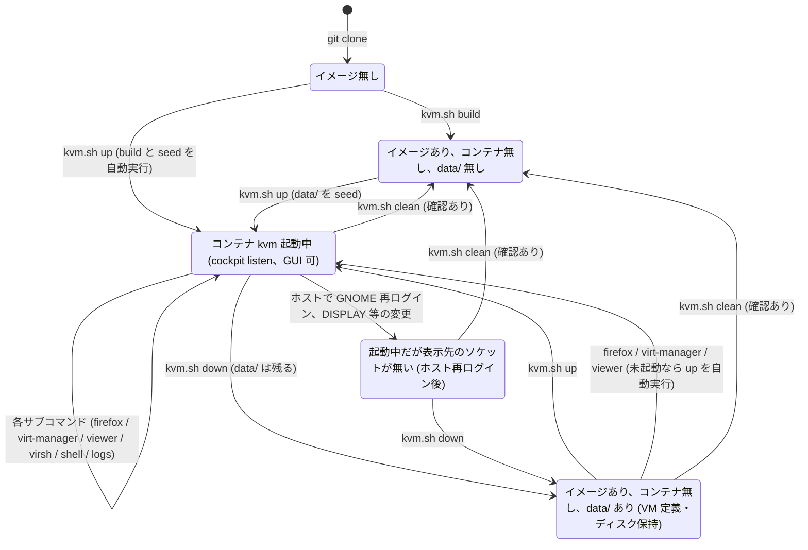

図 20: コンテナと `data/` のライフサイクル。`down` は `data/` を残し、`clean` だけが消す。イメージは `clean` でも残る。

## 9. 検証手順

自動テストは無い。変更後は静的検査と、README 末尾の確認手順を手で流す。

### 9.1 静的検査

```bash
bash -n kvm.sh host/wsl.sh container/gui container/gui-user-setup
shellcheck kvm.sh host/wsl.sh container/gui container/gui-user-setup   # 入っていれば
```

### 9.2 物理 AlmaLinux 10 + GNOME

| コマンド | 期待結果 | 検証していること |
| --- | --- | --- |
| `getenforce` | `Enforcing` のままで可 | SELinux を緩めずに動く (seed の `label=disable`、本体の `--privileged`) |
| `env \| grep -E 'DISPLAY\|WAYLAND\|XDG_RUNTIME\|XAUTH'` | 値が入っている | `gui_args` が表示先を取得できる |
| `ss -ltn \| grep 9091` | 何も出ない | `check_host_network` を通る (出るなら `COCKPIT_PORT` を変える) |
| `./kvm.sh up && ./kvm.sh firefox` | cockpit が firefox で開く (自己署名証明書の警告) | 起動シーケンス全体と Wayland 表示 |
| `sudo podman exec kvm systemctl is-system-running` | `running` (`degraded` ではない) | Containerfile の unit マスク群が効いている **(実質的な回帰テスト)** |
| `sudo podman exec kvm ls -la /dev/dri` | `renderD*` が 0666 | `kvm-perms.service` |
| `sudo ausearch -m avc -ts recent` | 拒否が無い | SELinux 上の問題が無い |
| `./kvm.sh virt-manager` | GNOME にウィンドウが出る | session bus と Wayland 接続 |

### 9.3 Windows + WSL2

| コマンド | 期待結果 | 検証していること |
| --- | --- | --- |
| `./kvm.sh up && ./kvm.sh firefox` | WSLg 経由で Windows に Firefox (cockpit) が出る | WSL 判定、`/mnt/wslg/runtime-dir` の扱い |
| `sudo podman exec kvm ss -xp \| grep wayland` | `/mnt/wslg/runtime-dir/wayland-0` に接続している | X11 フォールバックではなく Wayland (図 9 の経路) |
| `sudo podman exec kvm findmnt /run/user/$UID` | コンテナ専用の tmpfs | ホストの runtime dir を `/run/user/UID` にマウントしていない (図 8) |
| `ls -A /run/user/$UID && systemctl --user is-system-running` | cockpit ログイン → ログアウト後も一覧が変わらず `running` | ホストのセッションが無傷 (図 19 の r1 が再発していない) |

### 9.4 その他の確認点 (変更内容に応じて)

| 変更箇所 | 確認 |
| --- | --- |
| `KVM_BRIDGE` 周り | `./kvm.sh virsh net-list` で `bridged` が active。`KVM_BRIDGE` 無しで `up` すると消える |
| `down` | ホストに `virbr0` と dnsmasq が残らない。`down` → `up` で VM 定義とディスクが復元される |
| `COCKPIT_PORT` | 使用中のポートを指定すると `up` が中止する。`firefox` が開く URL が新しいポートに追従する |
| `install-desktop` / `launch` | Activities から起動できる。コンテナ未起動時と sudo 失敗時に通知が出る |
| パスワード | ホストユーザーのパスワードで cockpit にログインできる。`admin` ではログインできない。`podman run` のコマンドラインにハッシュが出ない |

## 付録 A. ファイル一覧とコンテナ内配置

| リポジトリ内 | コンテナ内 (Containerfile の COPY) | モード | 備考 |
| --- | --- | --- | --- |
| `kvm.sh` | (ホスト側) | 実行可能 | |
| `host/wsl.sh` | (ホスト側、source) | | |
| `desktop/kvm-firefox.desktop` `desktop/kvm-virt-manager.desktop` | (ホスト側、`install-desktop` が `~/.local/share/applications/` へ) | | `@KVM_SH@` を置換 |
| `Containerfile` | | | イメージ定義 |
| `container/gui` | `/usr/local/bin/gui` | `chmod +x` | |
| `container/gui-user-setup` | `/usr/local/bin/gui-user-setup` | `chmod +x` | |
| `container/gui-user.service` | `/etc/systemd/system/gui-user.service` | | `systemctl enable` |
| `container/kvm-perms.service` | `/etc/systemd/system/kvm-perms.service` | | `systemctl enable` |
| `container/kvm-net-teardown.service` | `/etc/systemd/system/kvm-net-teardown.service` | | `systemctl enable` |
| `container/cockpit-listen-generator` | `/usr/lib/systemd/system-generators/cockpit-listen` | `chmod +x` | |
| `container/cockpit.conf` | `/etc/cockpit/cockpit.conf` | | |
| `.gitignore` | | | `*.iso` `*.qcow2` `build.log` `data/` |
| `data/` (git 管理外) | `/var/lib/libvirt` `/etc/libvirt` `/home/<HOST_USER>` | rw バインドマウント | `up` が作成・seed |

## 付録 B. 主要な変更履歴

不変条件がどの不具合から生まれたかの索引。詳細はコミットメッセージを参照。

| PR | 要旨 | 本書の関連節 |
| --- | --- | --- |
| 2 | `systemd-logind` のマスク解除。cockpit ログイン直後の自動ログアウトを修正 | 3.4、6 |
| 3 | 永続化を named volume からホストディレクトリのバインドマウントに変更 (seed 処理) | 4.6 |
| 5 | `install-desktop` / `launch` の追加 | 4.7 |
| 8 | Quadlet / sudoers 配置の廃止、コンテナ名・イメージ名・データディレクトリを固定値に | 1.3、3.3 |
| 9 | cockpit にホストのユーザー名・パスワードでログインできるように (テンプレートユーザーのリネーム、ハッシュの env-file 渡し) | 4.3、5.4、7 |
| 10 | ホストの runtime dir を読み取り専用の別パスにマウント。cockpit ログアウトでホストの `/run/user/UID` が消える問題を修正。GUI ユーザーの linger | 4.4、5.3、6 |
| 11 | `NetworkManager-wait-online.service` をマスク。起動完了が 1 分遅れて degraded になるのを防ぐ | 3.4 |
| 12 | WSL2 専用処理を `host/wsl.sh` に分離 (`host_*` フック) | 2.1、5.6 |
| 13 | ベースイメージを AlmaLinux 10 minimal に変更、明示パッケージを最小化 | 3.4 |
| 14 | `--network host` と `KVM_BRIDGE` (libvirt ネットワーク `bridged`)、`cockpit-listen-generator`、`kvm-net-teardown.service`、NetworkManager のマスク | 4.5、5.2、5.7 |
| 15 | 物理 AlmaLinux 10 対応: seed の `label=disable`、`iscsid.socket` のマスク、cockpit 既定ポート 9091、ポート使用中の検出、firefox の URL をポートに追従 | 2.4、3.4、4.5 |
| 16 | CLAUDE.md の追加 | |
