# qemu-kvm コンテナ 仕様書

本書は、このリポジトリ (qemu-kvm / libvirt / virt-viewer を 2 つの systemd コンテナに収め、軽量なホストで VM を動かし、
コマンドライン (virsh / virt-install) で操作してその画面をホストのデスクトップに表示する仕組み) の **現状の実装 (as-built) を仕様として記述したもの**です。

| 項目 | 内容 |
| --- | --- |
| 対象コミット | main (PR 28「WSL2 対応とホスト種別フックを削除する」まで。付録 B) |
| 対象読者 | 利用者 (CLI・環境変数・データの扱いを知りたい人) と保守者 (起動/停止の順序、各 unit の役割、変えてはいけない構成を知りたい人) |
| 出典 | `kvm.sh` `Containerfile` `container/{common,kvm,gui}/*` `desktop/*` `.gitignore`、README.md と docs/*.md の手順書、CLAUDE.md、git の変更履歴。本書はこれらに書かれている事実のみを記述し、実装に無い振る舞いは書かない |
| 他文書との分担 | README.md = 手順書の一覧と記法、docs/setup.md / vm.md / desktop.md / bridge.md = 導入手順と使い方 (変更後の確認手順は各手順書の付録)、CLAUDE.md = 変更時の注意点、本書 = 振る舞いの定義。手順は各手順書を参照し、本書では繰り返さない |
| 記法 | 実行時メッセージとコード内コメントは英語なので原文のまま引用する。`>> ` は進捗、`!! ` は警告/エラー (stderr)。図中の `UID` はホストユーザーの uid、`USER` はホストユーザー名を表す |

目次

1. [概要](#1-概要)
2. [対応環境・前提条件](#2-対応環境前提条件)
3. [システム構成](#3-システム構成)
4. [外部インターフェース仕様](#4-外部インターフェース仕様)
5. [内部仕様 (処理シーケンス)](#5-内部仕様-処理シーケンス)
6. [設計上の不変条件](#6-設計上の不変条件)
7. [セキュリティ考慮事項](#7-セキュリティ考慮事項)
8. [既知の制限事項](#8-既知の制限事項)
9. [検証手順](#9-検証手順)
- [付録 A. ファイル一覧とコンテナ内配置](#付録-a-ファイル一覧とコンテナ内配置)
- [付録 B. 主要な変更履歴](#付録-b-主要な変更履歴)

## 1. 概要

### 1.1 目的

qemu も libvirt も入っていない軽量なホストに **podman だけ**を入れ、VM の実行に必要なものをコンテナに閉じ込める。
VM の作成・操作はコマンドライン (`kvm.sh virt-install` / `kvm.sh virsh`)、画面は virt-viewer (`kvm.sh viewer`) で、ブラウザや Web コンソールは使わない。
役割・権限・寿命の境界で 2 つのコンテナに分かれている。

| コンテナ | 役割 | 権限 | 寿命 |
| --- | --- | --- | --- |
| `kvm` | サーバ: libvirt + qemu-kvm + virt-install | `--privileged --network host` | VM が動いている間は常駐 |
| `kvm-gui` | デスクトップクライアント: virt-viewer (と診断用の virsh) をホストの画面に表示 | 非特権 (`--security-opt label=disable`、`--network host`) | ディスプレイのあるホストだけ。ホストの再ログイン後はこれだけ作り直す |

`kvm-gui` は両コンテナが共有する `/run/libvirt` の unix ソケット経由で `kvm` の libvirt に接続する。ディスプレイの無いホストでは
`kvm` だけを使い、VM は CLI で扱う (画面表示は無い。GUI イメージのビルドも不要)。

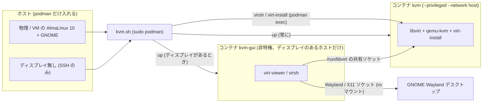

図 1: 利用形態。どちらのホストも `kvm.sh` 経由で同じ `kvm` コンテナを動かし、ディスプレイがあるときだけ `kvm-gui` を足す。
画面の出口 (GNOME デスクトップ、headless では無し) だけが変わり、VM の操作はどちらのホストでも `kvm.sh` の virsh / virt-install。

### 1.2 スコープ外

| 項目 | 理由 (出典) |
| --- | --- |
| SPICE | RHEL 10 系の qemu-kvm に SPICE が無い。VM のグラフィックスは VNC (docs/vm.md「選択した方針」) |
| Web コンソール (cockpit) とブラウザ (firefox) | 廃止した。VM の操作は CLI、画面は virt-viewer (PR 25) |
| ホストのネットワーク設定の変更 | ブリッジは利用者がホスト側で作る。`kvm.sh` はホストの NIC やブリッジを作らない |
| 自動テスト | テストスイートは無い。検証は docs/setup.md と docs/vm.md の付録の確認手順を手で流す (9 章) |

### 1.3 用語

| 用語 | 意味 |
| --- | --- |
| ホスト | `kvm.sh` を実行するマシン (物理/VM の AlmaLinux 10。ディスプレイの有無は問わない) |
| ロール | `kvm` (サーバ) と `gui` (デスクトップクライアント)。`kvm.sh` のサブコマンド `build` / `up` / `down` / `shell` / `logs` が第 1 引数として受け取る |
| コンテナ | ロール `kvm` のコンテナ名は `kvm`、ロール `gui` は `kvm-gui` (`kvm.sh` の変数 `KVM_CONTAINER` / `GUI_CONTAINER`) |
| イメージ | `localhost/kvm-container/kvm:latest` と `localhost/kvm-container/gui:latest` (`KVM_IMAGE` / `GUI_IMAGE`)。1 つの Containerfile の `--target kvm` / `--target gui` |
| ホストユーザー | `kvm.sh` を実行した一般ユーザー。`id -un` / `id -u` / `id -g` の値が `HOST_USER` / `HOST_UID` / `HOST_GID` になる |
| GUI ユーザー | 両コンテナ内でホストユーザーと同じ名前・uid/gid を持つユーザー。パスワードは無く (ロック)、ログインには使わない |
| ホスト runtime dir | ホストの `$XDG_RUNTIME_DIR` (GNOME では `/run/user/UID`)。`kvm-gui` の `/run/host-xdg-runtime` に読み取り専用でマウントされる |
| コンテナ runtime dir | コンテナ内の `/run/user/UID`。コンテナの logind が GUI ユーザー用に作る (`kvm` では tmpfs、非特権の `kvm-gui` では `/run` 直下の通常のディレクトリ)。ホストとは無関係 |
| 共有 run dir | ホストの `/run/kvm-container/libvirt` (`KVM_RUN_DIR`)。両コンテナの `/run/libvirt` にバインドマウントされ、libvirt のソケットを共有する。`up` で空にし `down` で消す |
| セッション ID | `GUI_ARGS` (ホストのセッションをコンテナに渡す `podman run` 引数) の SHA-256 先頭 16 桁。`kvm-gui` のラベル `kvm.gui-session` に記録し、再ログインの検出に使う |
| `data/` | リポジトリ直下の永続化ディレクトリ (git 管理外、root 所有)。VM のディスク・定義・GUI ユーザーのホームを保持する |

## 2. 対応環境・前提条件

### 2.1 ディスプレイの判定 (`have_display`)

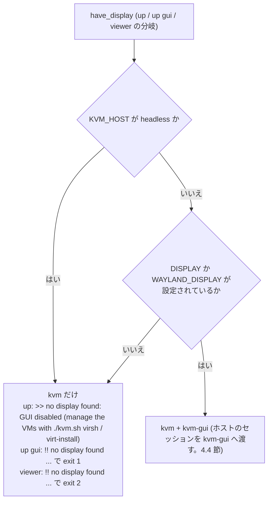

図 2: GUI コンテナを使うかの判定 (`kvm.sh` の `have_display`)。ホスト種別の判定は行わず、
`KVM_HOST=headless` と表示用環境変数の有無だけで決まる。`kvm` コンテナはどちらの経路でも同じように起動する。

| ホスト | 画面表示 | 起動するコンテナ |
| --- | --- | --- |
| 物理 / VM の AlmaLinux 10 + GNOME (Wayland) | GNOME デスクトップ | `kvm` + `kvm-gui` |
| ディスプレイ無し (SSH のみ、または `KVM_HOST=headless`) | 無し (VM は CLI で操作) | `kvm` のみ (GUI イメージのビルドも不要) |

### 2.2 ホスト要件

| 要件 | 内容 | 確認・処理箇所 |
| --- | --- | --- |
| podman | root で利用 (`sudo podman`)。`kvm.sh` のすべての podman 操作は `PODMAN="sudo podman"` 経由 | `kvm.sh` |
| KVM | CPU 仮想化 (AMD SVM / Intel VT-x)。`/dev/kvm` が無ければ `modprobe kvm_amd` (`/proc/cpuinfo` に `AuthenticAMD`) または `kvm_intel` を試み、それでも無ければ `!! /dev/kvm not found. Enable SVM (AMD) / VT-x (Intel) in the firmware and check sudo modprobe kvm_amd or kvm_intel` を出して exit 1 (この modprobe は x86 前提。aarch64 では KVM が組み込みで `/dev/kvm` が最初からある) | `ensure_kvm` (`start_kvm` から) |
| `modprobe` | `/dev/kvm` が無いときに必要。無ければ `!! modprobe not found: sudo dnf install kmod` で exit 1 | `ensure_kvm` |
| デスクトップセッション (GUI を使う場合) | GNOME にログインした端末から実行する。`XDG_RUNTIME_DIR` が実在しなければ `!! XDG_RUNTIME_DIR (...) does not exist. Run this from a terminal inside a desktop session` で exit 1 | `gui_args` |
| GPU (任意) | `/dev/dri` があれば `--device /dev/dri` で `kvm-gui` に渡す。無ければソフトウェア描画 | `gui_args` |
| SELinux | Enforcing のままで可。`kvm` は `--privileged`、`kvm-gui` と seed 用コンテナは `--security-opt label=disable` で、いずれもラベル分離無し | `start_kvm` / `start_gui` / `prepare_data_dir` |
| ホストの `/run` | `/run/kvm-container/libvirt` を作れること (tmpfs 上、`sudo`) | `start_kvm` / `start_gui` |
| リポジトリの位置 | ユーザーのホーム配下にクローンする。`data/` はその中に作られる (`KVM_DATA_DIR=$PWD/data`) | `kvm.sh` |

### 2.3 実行ユーザーの要件

| 要件 | 振る舞い |
| --- | --- |
| root で実行しない | `host_user_args` が uid 0 を検出すると `!! run kvm.sh as a regular user, not root (the container user mirrors the invoking user)` で exit 1。`install-desktop` / `uninstall-desktop` も root を拒否する |
| `sudo` が使える | `podman`、`modprobe`、`chmod /dev/kvm`、`data/` と `/run/kvm-container` の操作に使う |
| `launch` (Activities から起動) を使う場合 | パスワード無しで `sudo podman` を実行できる sudoers 設定が必要 (`sudo -n` で実行するため。4.7 節) |

### 2.4 起動前に確認されるホスト資源 (`check_host_network`、`kvm` の起動時)

| 確認 | 条件 | 結果 |
| --- | --- | --- |
| ブリッジの存在 | `KVM_BRIDGE` が設定され、`/sys/class/net/$KVM_BRIDGE/bridge` が無い | `!! KVM_BRIDGE=... is not a bridge on this host. Create it first (see docs/bridge.md)` で exit 1 |
| `virbr0` の残存 | `/sys/class/net/virbr0` がある | 警告のみ (`!! virbr0 already exists on the host ...` と `sudo ip link del virbr0` の案内)。起動は続くが `default` ネットワークの起動は失敗する |

## 3. システム構成

### 3.1 全体構成

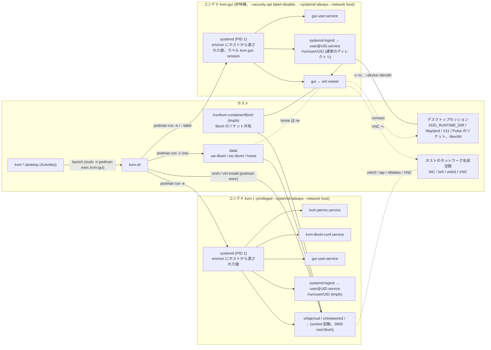

図 3: 全体構成。ホスト → コンテナの値は `podman run` の `-e` / `--label` で渡り (4.3 節)、表示用ソケットは
`kvm-gui` への読み取り専用マウントを通して connect する (4.4 節)。2 つのコンテナは `/run/libvirt` (ホストの `/run/kvm-container/libvirt`) と
`data/home` を共有する (3.5 節)。ネットワーク名前空間は両方ともホストと共有なので、libvirt のブリッジも VM の VNC もホスト上に現れ、
`kvm-gui` の virt-viewer は `localhost` でそれに届く (4.5 節)。VM の操作 (virsh / virt-install) は `kvm.sh` が `podman exec` で `kvm` 内で実行する。

### 3.2 3 層構造とファイル

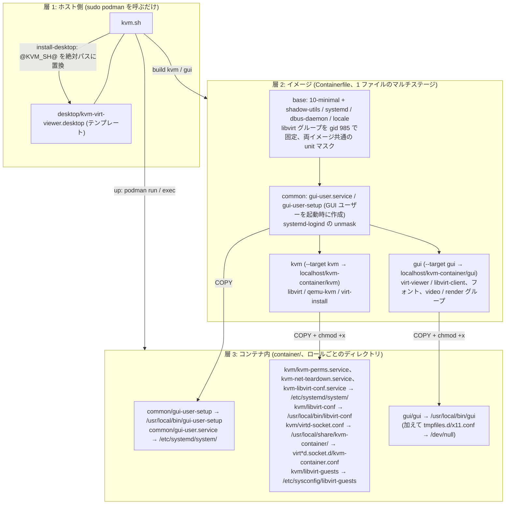

図 4: 3 層構造とマルチステージビルド。`base` と `common` は両イメージに入り、`kvm` / `gui` がそれぞれのターゲットになる。
どの層を触るかで影響範囲が変わる (ホスト側はコンテナを作り直さなくてよい、イメージと `container/` は該当ロールの `build` が必要)。

| ファイル | 層 | 入るイメージ | 役割 | 実行タイミング |
| --- | --- | --- | --- | --- |
| `kvm.sh` | ホスト | | 操作スクリプト。ホストのセッション環境とユーザー情報を `podman run` の引数に変換する | 利用者が実行 |
| `desktop/kvm-*.desktop` | ホスト | | Activities 用ランチャーのテンプレート | `install-desktop` が `~/.local/share/applications/` に配置 |
| `Containerfile` | イメージ | | AlmaLinux 10 minimal + `microdnf`。`base` → `common` → `kvm` / `gui` | `build` |
| `container/common/gui-user-setup` + `gui-user.service` | コンテナ | 両方 | GUI ユーザーをホストユーザーとして作り、linger を有効化 | 起動時 (sysinit、logind より前) |
| `container/kvm/kvm-perms.service` | コンテナ | kvm | `/dev/kvm` `/dev/net/tun` の権限と `ip_forward` | 起動時 (sysinit、virtqemud より前) |
| `container/kvm/kvm-libvirt-conf.service` + `libvirt-conf` | コンテナ | kvm | `/etc/libvirt` (= `data/etc-libvirt`) に `auth_unix_rw` と qemu.conf の設定を冪等に適用 | 起動時 (sysinit、virt*d の .socket より前) |
| `container/kvm/virtd-socket.conf` | コンテナ | kvm | `virt{qemu,network,storage,nodedev,secret}d.socket` の drop-in (`SocketMode=0660` `SocketGroup=libvirt`) | ビルド時に配置、socket 起動時に効く |
| `container/kvm/kvm-net-teardown.service` | コンテナ | kvm | 停止時に libvirt ネットワークを `net-destroy` | 停止時 (`ExecStop`、`libvirt-guests` より後) |
| `container/kvm/libvirt-guests` | コンテナ | kvm | `libvirt-guests.service` の設定。停止時に動いている VM を ACPI シャットダウン (最大 120 秒) | 停止時 (`ExecStop`、VM の machine scope より前) |
| `container/gui/gui` | コンテナ | gui | GUI ユーザーとしてアプリをホストの画面に起動 | `kvm.sh viewer` / `launch` から `podman exec` |

### 3.3 コンテナ実行仕様 (`podman run`)

`start_kvm` が発行する `kvm` の `podman run` 引数 (順序も同じ):

| 引数 | 値 | 目的 |
| --- | --- | --- |
| `-d --name kvm --hostname kvm` | 固定 | コンテナ名・ホスト名 |
| `--privileged` | 固定 | KVM、libvirt、logind、ラベル分離無しのバインドマウント |
| `--systemd=always` | 固定 | `/sbin/init` を PID 1 として動かす |
| `--network host` | 固定 | VM をホストのブリッジに接続できるようにする。帰結は 4.5 節 |
| `--device /dev/kvm --device /dev/net/tun` | 固定 | VM の実行と tap デバイス |
| `-v data/var-libvirt:/var/lib/libvirt` `-v data/etc-libvirt:/etc/libvirt` `-v data/home:/home/<HOST_USER>` | rw | 永続化 (4.6 節) |
| `-v /run/kvm-container/libvirt:/run/libvirt` | rw | libvirt ソケットの共有 (3.5 節) |
| `HOST_ARGS` | `-e HOST_USER= -e HOST_UID= -e HOST_GID=` | ホストユーザーの写し (4.3 節) |
| `-e TZ=${TZ:-Asia/Tokyo}` | 既定 `Asia/Tokyo` | コンテナのタイムゾーン |
| `--shm-size 2g` | 固定 | 共有メモリ |
| イメージ | `localhost/kvm-container/kvm:latest` | |

`start_gui` が発行する `kvm-gui` の `podman run` 引数:

| 引数 | 値 | 目的 |
| --- | --- | --- |
| `-d --name kvm-gui --hostname kvm-gui` | 固定 | コンテナ名・ホスト名 |
| `--systemd=always` | 固定 | `/sbin/init` を PID 1 として動かす。**`--privileged` は付けない** |
| `--network host` | 固定 | virt-viewer が VM の VNC (ホストの loopback) に届くため。listen するものは無い |
| `--security-opt label=disable` | 固定 | SELinux Enforcing のホストで、特権コンテナが作った unix ソケットへ connect し、ホストの runtime dir を読むため |
| `--label kvm.gui-session=<セッション ID>` | `GUI_ARGS` の SHA-256 先頭 16 桁 | 再ログインの検出 (5.1 節) |
| `-v data/home:/home/<HOST_USER>` | rw | virt-viewer の設定等 (`kvm` と同じホーム) |
| `-v /run/kvm-container/libvirt:/run/libvirt` | rw | libvirt ソケットの共有 |
| `HOST_ARGS` | `-e HOST_USER= -e HOST_UID= -e HOST_GID=` | ホストユーザーの写し |
| `GUI_ARGS` | ro マウント、`-e WAYLAND_DISPLAY/DISPLAY/XAUTHORITY/PULSE_SERVER/HOST_RUNTIME_DIR/LIBGL_ALWAYS_SOFTWARE`、`--device /dev/dri` | ホストのセッション (4.4 節) |
| `-e TZ=${TZ:-Asia/Tokyo}` `--shm-size 2g` | 同上 | |
| イメージ | `localhost/kvm-container/gui:latest` | |

### 3.4 イメージ仕様 (`Containerfile`)

| ステージ | `FROM` | 内容 |
| --- | --- | --- |
| `base` | `quay.io/almalinuxorg/10-minimal:10` | `LANG=ja_JP.UTF-8` `LC_ALL=ja_JP.UTF-8` `container=podman`。`shadow-utils` (minimal には無い) を先に入れ、`ARG LIBVIRT_GID=985` で `groupadd -r -g 985 libvirt` (パッケージが gid を割り当てる前に固定。985 はシステム範囲で、ホストユーザーの gid とは衝突しない)。続けて `systemd` (minimal には無い) `dbus-daemon` (dbus-broker の代わり) `glibc-langpack-ja` `glibc-langpack-en`。両イメージ共通の unit マスク (図 6)。`STOPSIGNAL SIGRTMIN+3`、`CMD ["/sbin/init"]` |
| `common` | `base` | `gui-user.service` / `gui-user-setup` を配置して enable (一般ユーザーはイメージに焼き込まず、起動時に作る)。`systemd-logind.service` を unmask |
| `kvm` | `common` | `iputils` `procps-ng` `libvirt` `libvirt-daemon-kvm` `virt-install`。`container/kvm/*` を配置し (`libvirt-guests` は `/etc/sysconfig/libvirt-guests` へ)、`virtd-socket.conf` を 5 つの `.socket.d/kvm-container.conf` に `install`。unit を enable (図 6) |
| `gui` | `common` | `virt-viewer` `libvirt-client` `util-linux-core` (runuser / setsid) `dejavu-sans-fonts` `google-noto-sans-cjk-vf-fonts` `tar`。`video` / `render` グループが無ければ作る (GUI ユーザーの追加は起動時に `gui-user-setup` が行う)。`gui` を配置。`/etc/tmpfiles.d/x11.conf` → `/dev/null` |

パッケージ方針は「依存で入らないものだけを、それが来るステージに列挙する」。`microdnf --setopt=install_weak_deps=0` (`False/True` は不可)。

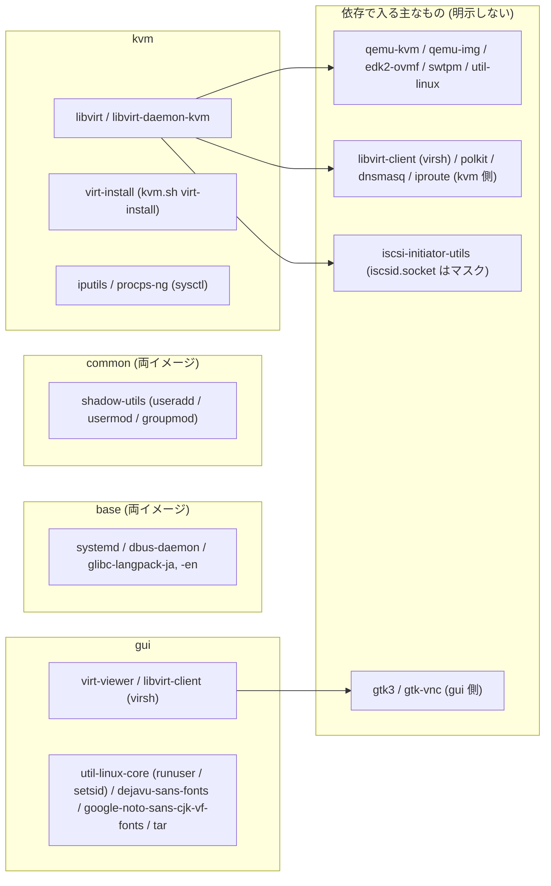

図 5: ステージごとの明示パッケージと、依存で入る主なもの (Containerfile のコメントから)。`procps-ng` は弱い依存でしか引かれないため
`kvm-perms.service` の `sysctl` 用に、`util-linux-core` は systemd の弱い依存でしかないため `gui` の `runuser` / `setsid` 用に明示している。

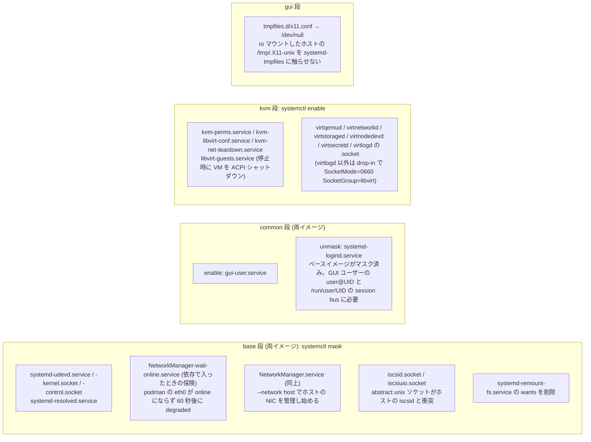

図 6: コンテナ内 systemd unit の状態 (ステージ別)。マスクは `base` にまとめてあるので、そのステージに入らない unit
(`gui` イメージの NetworkManager や iscsid など) に対しても無害に効く。

### 3.5 コンテナ間の libvirt 接続

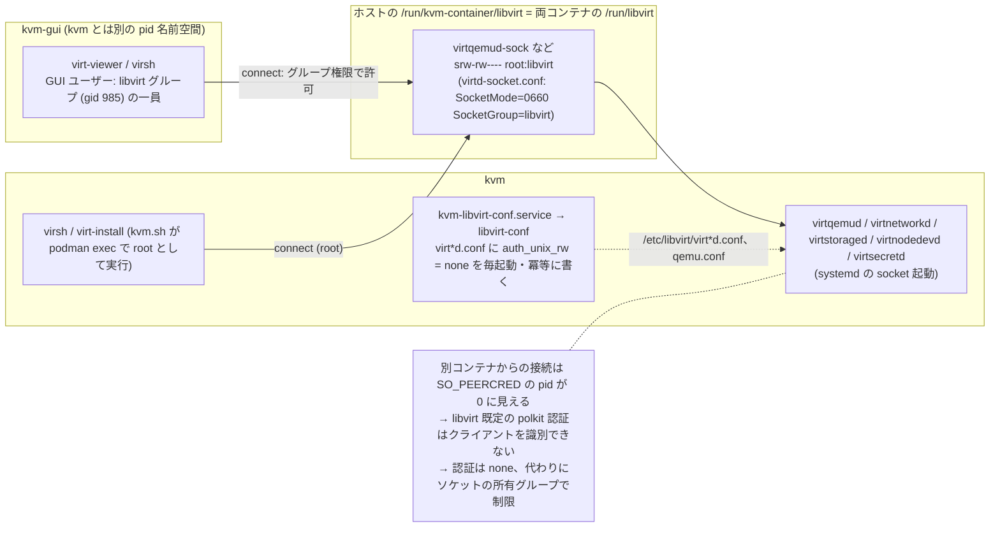

図 7: `kvm-gui` から `kvm` の libvirt に届く仕組み。認証をソケットの権限に置き換え、そのために `libvirt` グループの gid を両イメージで揃えている。

| 要素 | 仕様 | 理由 |
| --- | --- | --- |
| 共有ディレクトリ | ホストの `/run/kvm-container/libvirt` (tmpfs) を両コンテナの `/run/libvirt` に rw でバインドマウント。`start_kvm` が起動前に **中身だけ** 空にし (`find -mindepth 1 -delete`)、`down` (引数なし) が `/run/kvm-container` ごと削除する | コンテナ自身の `/run` と同様に起動時は空である必要がある (前回のソケット・pid・VM 状態が残るとデーモンが混乱する)。ディレクトリ自体を消さないのは、起動中の `kvm-gui` がマウントしている inode を保つため |
| 認証方式 | `virtqemud` `virtnetworkd` `virtstoraged` `virtnodedevd` `virtsecretd` の `.conf` に `auth_unix_rw = "none"` (`libvirt-conf` が該当ファイルがあるものだけ設定) | 別 pid 名前空間からの接続では `SO_PEERCRED` の pid が 0 になり polkit が成立しない |
| ソケット権限 | `virtd-socket.conf` (drop-in `virt*d.socket.d/kvm-container.conf`): `SocketMode=0660` `SocketGroup=libvirt`。`virtlogd.socket` は対象外 | socket 起動では `/etc/libvirt/*.conf` の `unix_sock_group` / `unix_sock_rw_perms` ではなく `.socket` unit の設定が権限を決める |
| グループ | `libvirt` の gid は `base` 段で 985 に固定 (`LIBVIRT_GID`)。GUI ユーザーは `gui-user-setup` が両イメージで `libvirt` に入れる | `kvm-gui` 側のユーザーがソケットに届くには gid の一致が必要 |
| qemu.conf | `libvirt-conf` が `security_driver = "none"`、`namespaces = []` を設定 | コンテナ内の qemu にゲストの SELinux ラベル付けと VM ごとのマウント名前空間は使えない |
| 適用方法 | `libvirt-conf` の `set_key`: `^#?key = ` の行があれば置換、無ければ末尾に追記。それ以外の行は触らない | `/etc/libvirt` は `data/etc-libvirt` で空のときしか seed されないため、ビルド時に書いても既存の `data/` には届かない。起動ごとの冪等適用なら旧 `data/` もそのまま使える |
| 診断 | `sudo podman exec kvm-gui runuser -u $USER -- virsh -c qemu:///system list` が通ればコンテナをまたぐ接続は正常 (CLAUDE.md の回帰テスト) | |

## 4. 外部インターフェース仕様

### 4.1 CLI (`kvm.sh <サブコマンド> [ロール] ...`)

`kvm.sh` は `set -euo pipefail` で動き、最初に自分のディレクトリへ `cd` する (すべての相対パスはリポジトリ直下基準)。
`build` / `up` / `down` / `shell` / `logs` は第 1 引数が `kvm` または `gui` ならロールとして取り込む (`role_arg`)。
引数無し、または未知のサブコマンドでは `usage` (ヘッダコメントの 2 行目から最初の非コメント行の手前まで) を表示する。

| サブコマンド | 引数 | 前提 | 動作 | 終了 |
| --- | --- | --- | --- | --- |
| `build [kvm\|gui] [podman build 引数]` | ロール省略で両方 | | ロールごとに `podman build --target <role> -t localhost/kvm-container/<role>:latest -f Containerfile "$@" .` (`>> building ... (Containerfile target <role>)`) | podman の終了コード |
| `up [kvm\|gui]` | 追加引数があれば usage で 1 | 2 章の要件 | 省略: `start_kvm` → `have_display` なら `start_gui`、無ければ `>> no display found: GUI disabled (manage the VMs with ./kvm.sh virsh / virt-install)`。`kvm`: `start_kvm` のみ。`gui`: `have_display` でなければ `!! no display found (DISPLAY / WAYLAND_DISPLAY unset, or KVM_HOST=headless): the GUI container is not needed` で 1、あれば `start_gui` のみ (5.1 節) | `kvm` の readiness が 30 秒で確認できなければ `!! could not confirm startup. Check systemctl --failed via ./kvm.sh shell` で 1 |
| `down [kvm\|gui]` | 追加引数があれば usage で 1 | | 省略: `kvm-gui` を `podman rm -f -i -t 10`、`kvm` を `podman rm -f -i -t 180` (`KVM_STOP_TIMEOUT`。動いている VM があれば先に `>> shutting down the running VMs (up to 120 s)...`)、さらに `sudo rm -rf /run/kvm-container`。`kvm` / `gui`: そのコンテナだけ (共有 run dir は残す)。`data/` は残る (5.2 節) | podman の終了コード |
| `clean` | 無し | | `kvm.sh down` (両方) → `data/` が無ければ `>> ... does not exist` で 0 → 削除対象と `du -sh` を表示 → `KVM_CLEAN_YES=1` でなければ `This deletes the VM disks and definitions as well. Continue? [y/N]` を尋ね、`y`/`Y` 以外は `>> aborted` で 1 → `sudo rm -rf data/` | 上記 |
| `viewer [VM名]` | VM 名 (省略可)、以降は virt-viewer の引数 | ディスプレイ | `have_display` でなければ `!! no display found (DISPLAY / WAYLAND_DISPLAY unset, or KVM_HOST=headless): virt-viewer needs a desktop session; manage the VMs with ./kvm.sh virsh` で 2。`kvm.sh up` (足りないものを起動し、再ログイン後は `kvm-gui` を作り直す) → `podman exec kvm-gui gui virt-viewer "$@"` (VM 名なしなら選択ダイアログ、5.3 節) | `gui` の終了コード |
| `virt-install ...` | virt-install の引数 | `kvm` 起動中 | `podman exec -it kvm virt-install --connect qemu:///system "$@"` | virt-install の終了コード |
| `virsh ...` | virsh の引数 | `kvm` 起動中 | `podman exec -it kvm virsh -c qemu:///system "$@"` | virsh の終了コード |
| `shell [kvm\|gui]` | ロール省略で `kvm` | 起動中 | `podman exec -it <container> bash` | bash の終了コード |
| `logs [kvm\|gui]` | ロール省略で両方 | | `kvm`: 起動中なら `journalctl --no-pager -n 30 -u kvm-libvirt-conf -u virtqemud -u gui-user`、でなければ `>> kvm is not running`。`gui`: 起動中なら `/var/log/gui.log` 末尾 50 行 + `journalctl -n 30 -u gui-user`、でなければ `>> kvm-gui is not running` | |
| `launch <app>` | `virt-viewer` | `.desktop` から呼ばれる。podman の NOPASSWD sudo | `sudo -n podman exec kvm-gui gui <app>` を実行し、失敗をデスクトップ通知にする (4.7 節)。他の引数は usage を出して 1 | 成功 0 / 失敗 1 |
| `install-desktop` | 無し | root 以外、デスクトップにログインしたユーザー | `gui` イメージが無ければ `build gui`。アイコン抽出と `.desktop` 配置 (4.7 節) | 0 |
| `uninstall-desktop` | 無し | root 以外 | `.desktop` とアイコンを削除 | 0 |

### 4.2 環境変数 (ホスト側の入力)

`kvm.sh` が利用者から受け取る変数:

| 変数 | 既定 | 意味 | 読む場所 |
| --- | --- | --- | --- |
| `KVM_HOST` | `auto` | `headless` にすると `have_display` が偽になり、表示用環境変数があっても `kvm-gui` を起動しない。`headless` 以外の値はすべて `auto` と同じ扱い (値の検証はしない) | `have_display` |
| `KVM_BRIDGE` | 未設定 | ホストの既存ブリッジ名。libvirt ネットワーク `bridged` として登録する。未設定なら `bridged` を削除 | `check_host_network`、`sync_bridged_network` |
| `KVM_SOFTWARE_GL` | 未設定 | `1` でソフトウェア描画を強制 (`LIBGL_ALWAYS_SOFTWARE=1`)。`/dev/dri` が無いホストでは設定しなくても強制される | `gui_args` |
| `TZ` | `Asia/Tokyo` | 両コンテナのタイムゾーン | `podman run -e TZ` |
| `KVM_CLEAN_YES` | 未設定 | `1` で `clean` の確認を省略 | `clean` |

セッションから読む変数 (`have_display` が真のとき、`gui_args`):

| 変数 | 用途 |
| --- | --- |
| `XDG_RUNTIME_DIR` | ホスト runtime dir。未設定なら空のままになり、`gui_args` が `!! XDG_RUNTIME_DIR () does not exist ...` で exit 1 |
| `WAYLAND_DISPLAY` | Wayland ソケット。相対名は runtime dir 基準。ソケットでなければ警告して Wayland を無効化 |
| `DISPLAY` | X11。設定されていれば `/tmp/.X11-unix` (realpath) を ro マウントする |
| `XAUTHORITY` | 設定されていて読めれば、コンテナ内パスに変換して渡す |
| `PULSE_SERVER` | 未設定なら `$XDG_RUNTIME_DIR/pulse/native` がソケットのときに `unix:` 形式で補う。`unix:` 以外はそのまま渡す。ソケットでなければ `audio disabled` |
| `XDG_DATA_HOME` / `HOME` | `install-desktop` の配置先 (`${XDG_DATA_HOME:-$HOME/.local/share}`) |

### 4.3 ホスト → コンテナの値の受け渡し

コンテナ内のスクリプトは、`podman run` で渡された値を **PID 1 (systemd) の環境** から `tr` で NUL を改行に変換して
`/proc/1/environ` を読むことで取得する。`podman exec` で起動するプロセス (`gui`) には同じ値が環境変数として継承される。

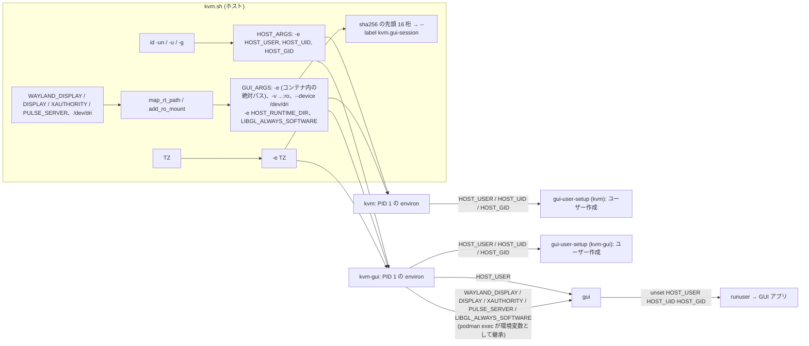

図 8: 値の流れ。ユーザー情報 (`HOST_ARGS`) は両コンテナに、セッション情報 (`GUI_ARGS`) は `kvm-gui` にだけ渡る。パスワードは渡さない
(コンテナにログインするものは無い)。`host_user_args` は一度組み立てたら再実行しない。

| 変数 | 渡し方 | 渡す先 | 値 | 読む側 |
| --- | --- | --- | --- | --- |
| `HOST_USER` `HOST_UID` `HOST_GID` | `-e` | 両方 | `id -un` / `id -u` / `id -g` | `gui-user-setup` (全部)、`gui` (`HOST_USER`) |
| `HOST_RUNTIME_DIR` | `-e` | `kvm-gui` | `/run/host-xdg-runtime` | `gui` (Xauthority の探索) |
| `WAYLAND_DISPLAY` `DISPLAY` `XAUTHORITY` `PULSE_SERVER` | `-e` (存在するものだけ) | `kvm-gui` | コンテナ内から見た絶対パス (`PULSE_SERVER` は `unix:` 付き、`DISPLAY` はホストの値そのまま) | `gui` → GUI アプリ。`gui_session_matches` も参照する |
| `LIBGL_ALWAYS_SOFTWARE` | `-e` (条件付き) | `kvm-gui` | `1` (`/dev/dri` が無いか `KVM_SOFTWARE_GL=1` のとき) | `gui` → GUI アプリ |
| `kvm.gui-session` | `--label` | `kvm-gui` | `GUI_ARGS` の各要素を改行区切りで `sha256sum` した先頭 16 桁 | `gui_session_matches` (`podman inspect`) |
| `TZ` | `-e` | 両方 | `${TZ:-Asia/Tokyo}` | コンテナ全体 |

新しい値を渡すときもこの流儀 (`-e` で渡し、PID 1 の environ から読む) に合わせる。

### 4.4 マウント仕様と表示の仕組み

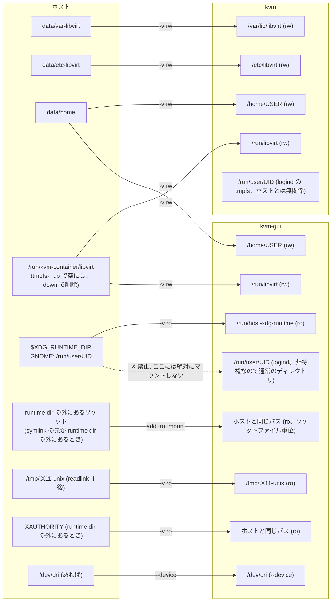

図 9: ホストのパスとコンテナ内パスの対応。ホストのセッション資源は `kvm-gui` にだけ、読み取り専用で入る。ホストの runtime dir は
別パスにマウントし、コンテナの `/run/user/UID` はコンテナの logind のものにする。この 2 つを混ぜないことが最重要の不変条件 (6 章)。

| ホスト | コンテナ | モード | 条件 | 目的 |
| --- | --- | --- | --- | --- |
| `data/var-libvirt` | `kvm` `/var/lib/libvirt` | rw | 常に | ディスクイメージ、ISO |
| `data/etc-libvirt` | `kvm` `/etc/libvirt` | rw | 常に | VM 定義、ネットワーク定義、libvirt の設定 (`kvm-gui` には無い) |
| `data/home` | 両方 `/home/<HOST_USER>` | rw | 常に | virt-viewer の設定等。1 つのホームを両方で使う |
| `/run/kvm-container/libvirt` | 両方 `/run/libvirt` | rw | 常に | libvirt のソケット共有 (3.5 節) |
| `$XDG_RUNTIME_DIR` | `kvm-gui` `/run/host-xdg-runtime` | ro | GUI 有効 | Wayland / Xwayland 認証 / Pulse のソケットに届くため。unix ソケットは ro でも connect できる |
| `readlink -f /tmp/.X11-unix` | `kvm-gui` `/tmp/.X11-unix` | ro | `DISPLAY` 設定時 | X11 フォールバック。ro にするのは systemd-tmpfiles にホストの X ソケットを消させないため |
| runtime dir 外のソケット (Wayland / Pulse) | `kvm-gui` 同じパス | ro | `map_rt_path` が失敗したとき | ソケットファイルだけをマウントする。親ディレクトリ (`/tmp` や `$HOME`) はマウントしない (コンテナ側のディレクトリを隠すため) |
| runtime dir 外の `XAUTHORITY` | `kvm-gui` 同じパス | ro | 同上 | `add_ro_mount` を通さず直接 `-v` (重複チェック無し) |
| `/dev/dri` | `kvm-gui` `/dev/dri` | `--device` | ホストに `/dev/dri` がある | GPU の render node。非特権なので明示的に渡す。`gui` が `renderD*` を 0666 にする |

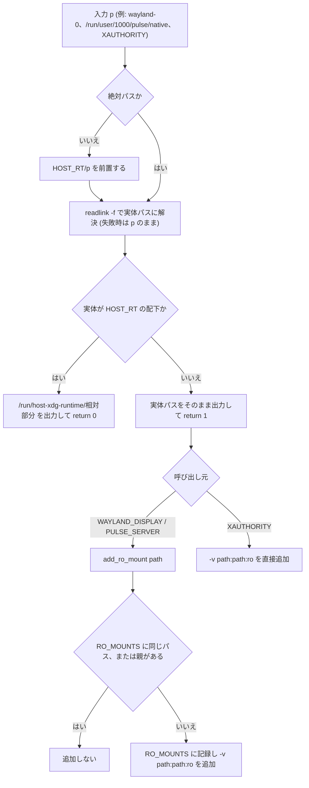

図 10: `map_rt_path` の変換規則と、runtime dir 外だったときの処理。GNOME の Wayland ソケットは runtime dir の中にあるので
通常は左の経路だけを通るが、symlink の先が runtime dir の外にある場合に備えて右の経路がある。

`gui_args` の出力 (`kvm-gui` の環境変数として `gui` に届く値):

| 条件 | 環境変数 / 引数 | 値 |
| --- | --- | --- |
| GUI 有効 | `HOST_RUNTIME_DIR` | `/run/host-xdg-runtime` |
| `WAYLAND_DISPLAY` がソケット | `WAYLAND_DISPLAY` | 絶対パス (libwayland 1.15 以降が受け付ける)。ソケットでなければ `!! WAYLAND_DISPLAY=... is not a socket (...); Wayland disabled, X11 is used if DISPLAY is set` |
| `DISPLAY` 設定、`/tmp/.X11-unix` がディレクトリ | `DISPLAY` | ホストの値そのまま |
| 上に加えて `XAUTHORITY` が読める | `XAUTHORITY` | 変換後のパス |
| Pulse ソケットあり | `PULSE_SERVER` | `unix:<変換後のパス>`。`unix:` 以外の値は無変換 |
| `/dev/dri` がある | `--device /dev/dri` | |
| `/dev/dri` が無い、または `KVM_SOFTWARE_GL=1` | `LIBGL_ALWAYS_SOFTWARE` | `1` |

### 4.5 ネットワークとポート

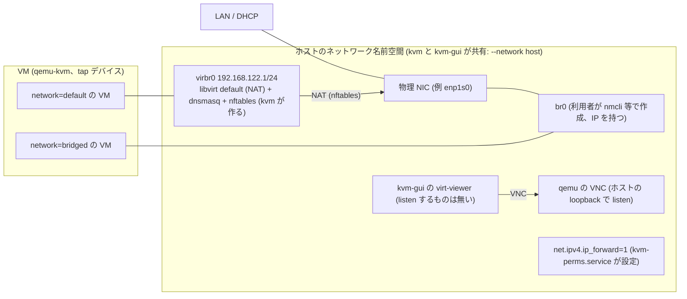

図 11: ネットワーク。コンテナ専用の名前空間は無く、libvirt が作るもの (virbr0、dnsmasq、nftables) も VM の VNC も
ホスト上に現れる。`kvm-gui` も同じ名前空間なので virt-viewer は `localhost` の VNC に届く。

| 項目 | 仕様 |
| --- | --- |
| ホストで listen するもの | VM の VNC (qemu、loopback) だけ。コンテナのサービスがホストのポートで listen することは無い |
| `default` ネットワーク | libvirt 標準の NAT (`virbr0`、192.168.122.0/24)。ホストで libvirt が動いていると衝突する (`virbr0` 検出で警告) |
| `bridged` ネットワーク | `KVM_BRIDGE` 指定時に `sync_bridged_network` が define/autostart/start する (5.6 節)。定義は `data/etc-libvirt` に永続化され、`KVM_BRIDGE` 無しで `up` すると削除される |
| ip_forward | `kvm-perms.service` が `net.ipv4.ip_forward=1` をホストの名前空間に設定する |
| `kvm-gui` | `--network host` だが listen するものは無く、ホストと衝突するポートやソケットは無い |
| 停止時 | `kvm-net-teardown.service` が全ネットワークを `net-destroy` し、残った `virbr*` を `ip link del` する (5.2 節) |

### 4.6 永続化データ (`data/`) と共有 run dir

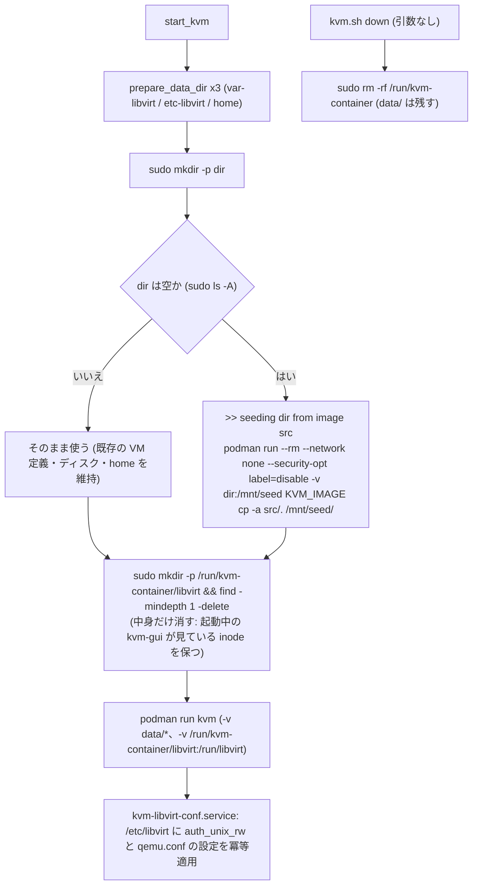

図 12: `data/` の初期化と共有 run dir の寿命。バインドマウントは named volume と違い初回にイメージ側の内容をコピーしないので、
空のときだけ `kvm` イメージの一時コンテナで `cp -a` する。seed 元は `/var/lib/libvirt` `/etc/libvirt` `/etc/skel` (ホームの雛形)。

| 項目 | 仕様 |
| --- | --- |
| 場所 | `<リポジトリ>/data/` (`KVM_DATA_DIR=$PWD/data`)。`.gitignore` で `data/` `*.iso` `*.qcow2` `build.log` を除外 |
| 所有者 | `sudo podman` で動くため root や qemu 所有。ホストから読み書きするには `sudo` が必要 |
| SELinux | どちらのコンテナもラベル分離無し (`kvm` は `--privileged`、`kvm-gui` は `label=disable`) なので `:Z` 等は不要。seed コンテナは `container_t` のままだと `user_home_t` の `data/` に書けないため `--security-opt label=disable` を付ける |
| `data/home` | 両コンテナの `/home/<HOST_USER>` にマウントされ、それぞれの `gui-user-setup` が `chown -R HOST_UID:HOST_GID` する |
| `data/etc-libvirt` | seed は空のときだけ。libvirt の認証設定と qemu.conf は `kvm-libvirt-conf.service` が起動ごとに上書きする (3.5 節) |
| `/run/kvm-container` | 永続化しない。`start_kvm` が `libvirt/` の中身を空にし、`start_gui` も `mkdir -p` する。`down` (引数なし) で削除 |
| 削除 | `data/` は `clean` のみ (`down` では残る) |

### 4.7 デスクトップ統合 (Activities からの起動)

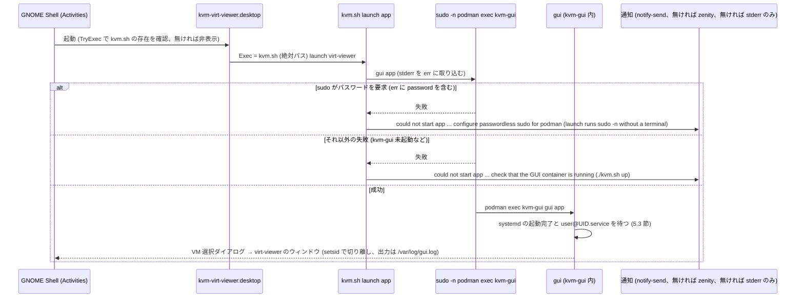

図 13: `.desktop` からの起動経路。端末が無く sudo のパスワードを入力できないため `sudo -n` を使い、失敗理由はデスクトップ通知で伝える。
`launch` は `kvm.sh viewer` と違って `up` を経由しないので、コンテナが止まっていれば通知で `./kvm.sh up` を案内する。

| 項目 | 仕様 |
| --- | --- |
| 配置先 | `${XDG_DATA_HOME:-$HOME/.local/share}/applications/kvm-virt-viewer.desktop`。アイコンは同 `icons/hicolor/<size>/apps/virt-viewer.*` |
| テンプレート置換 | `desktop/kvm-<app>.desktop` の `@KVM_SH@` を `<リポジトリ>/kvm.sh` (絶対パス) に置換 (`sed`)。リポジトリを移動したら再実行が必要 |
| `.desktop` の主要キー | `TryExec=@KVM_SH@` (無ければエントリ非表示)、`Exec="@KVM_SH@" launch virt-viewer`、`Icon=virt-viewer`、`StartupWMClass=virt-viewer`、`Terminal=false`、`Name[ja]` / `Comment[ja]` / `Keywords` の日本語 |
| アイコン抽出 | `gui` イメージの一時コンテナ (`--rm --network none`) で `/usr/share/icons/hicolor` から `apps/virt-viewer.*` だけを `tar` で取り出す。失敗しても続行 (汎用アイコンになる旨を表示) |
| 旧エントリの掃除 | `install-desktop` / `uninstall-desktop` は、以前のリビジョンが入れた `kvm-virt-manager.desktop` / `kvm-firefox.desktop` と `icons/hicolor/*/apps/{virt-manager,firefox}.*` を削除する (`remove_legacy_desktop`) |
| 後処理 | `update-desktop-database -q` (あれば)。配置先と Activities での検索語を表示 |
| `launch` の前提 | 実行ユーザーが `sudo -n podman` を実行できること。`launch` は `virt-viewer` 以外を拒否する |
| 通知 | `notify-send -a kvm.sh -i dialog-error "kvm-container" "<本文>"` → 無ければ `zenity --error --title=kvm-container --text=<本文>` → どちらも無ければ stderr のみ |
| 解除 | `uninstall-desktop` が `.desktop` と `icons/hicolor/*/apps/virt-viewer.*` を削除 |

### 4.8 ログとメッセージの規約

| 出力元 | 形式 | 出力先 |
| --- | --- | --- |
| `kvm.sh` の進捗 | `>> ...` | stdout |
| `kvm.sh` の警告・エラー | `!! ...` (続きの行は 3 スペースのインデント) | stderr |
| `gui-user-setup` (両コンテナ) | `gui-user: ...` (エラーは `gui-user: ERROR ...`) | journal (`gui-user.service`) |
| `libvirt-conf` (kvm) | 出力無し (失敗は unit の失敗として journal に残る) | journal (`kvm-libvirt-conf.service`) |
| `gui` 自身の警告 (kvm-gui) | `gui: ...`、headless は `!! GUI unavailable ...` | `podman exec` の stderr (`launch` 経由ではデスクトップ通知に含まれる) |
| GUI アプリの stdout/stderr | アプリの出力そのまま | `kvm-gui` 内 `/var/log/gui.log` (追記) |
| `kvm.sh logs` | `kvm`: `journalctl -n 30 -u kvm-libvirt-conf -u virtqemud -u gui-user`。`gui`: `gui.log` 末尾 50 行 + `journalctl -n 30 -u gui-user` | stdout |

## 5. 内部仕様 (処理シーケンス)

### 5.1 起動シーケンス (`kvm.sh up`)

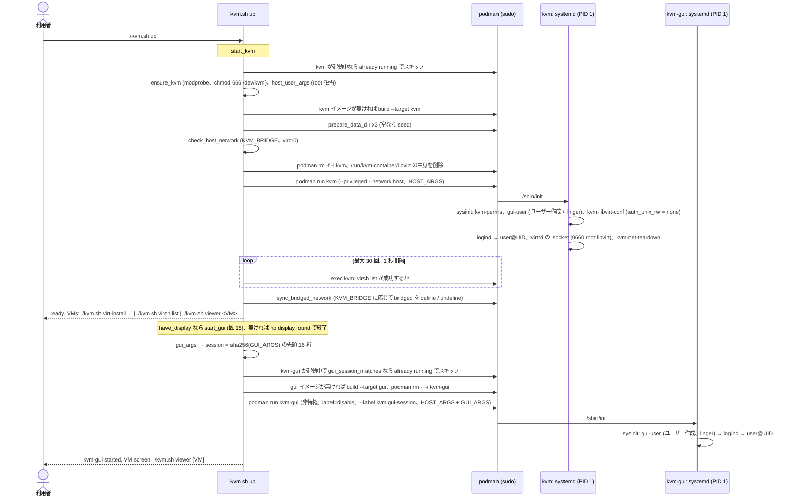

図 14: 起動シーケンス。`kvm` の起動と readiness 確認が終わってから `kvm-gui` を起動する。`kvm-gui` 側には readiness 待ちが無く、
代わりに `gui` がアプリ起動前に systemd の起動完了を待つ (5.3 節)。`up kvm` / `up gui` はそれぞれ片方だけを行う。

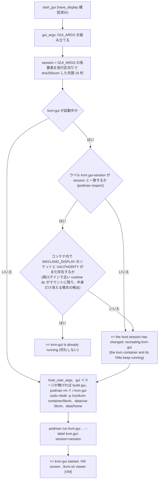

図 15: `start_gui` とセッション一致判定 (`gui_session_matches`)。ラベルの一致だけでは足りない (再ログイン後もソケットのパスが
同じことが多い) ので、コンテナ内からソケットの実在も確かめる。`kvm` と VM には手を触れない。

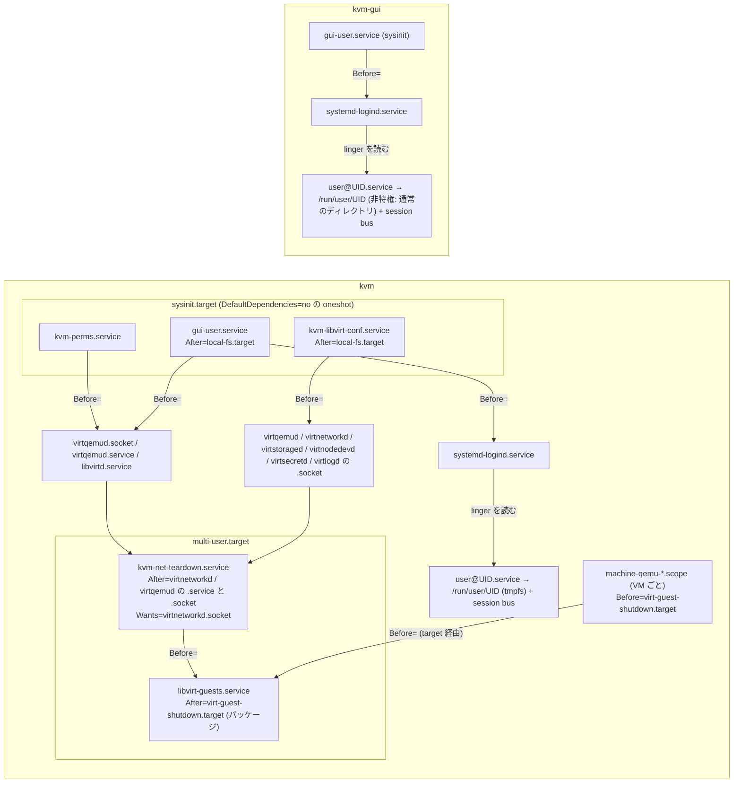

図 16: コンテナ内 unit の順序関係 (`Before=` / `After=` / `WantedBy=` から)。`gui-user.service` が logind より前なのは、
logind が `/var/lib/systemd/linger` を起動時にしか読まないため。`kvm-libvirt-conf` が全 `.socket` より前なのは、デーモンが設定を読む前に
`/etc/libvirt` を整えるため。`kvm-net-teardown` が virt*d の後なのは停止時に先に止まるため。`libvirt-guests` が teardown と VM の scope の後なのも同じで、
停止時は VM のシャットダウン → ネットワークの削除 → デーモンの停止の順になる。`gui-user.service` の `Before=virtqemud.socket`
は `kvm-gui` には該当 unit が無いので無視される。

起動後のメッセージ:

| 条件 | 出力 |
| --- | --- |
| `kvm` 起動 | `>> ready. VMs: ./kvm.sh virt-install ... \| ./kvm.sh virsh list \| ./kvm.sh viewer <VM>` |
| `kvm-gui` を (再) 作成 | `>> kvm-gui started. VM screen: ./kvm.sh viewer [VM]` |
| `kvm-gui` が現セッション用に起動中 | `>> kvm-gui is already running` |
| ディスプレイ無し (`up` 引数なし) | `>> no display found: GUI disabled (manage the VMs with ./kvm.sh virsh / virt-install)` |

### 5.2 停止シーケンス (`kvm.sh down`)

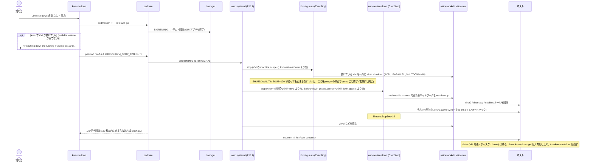

図 17: 停止シーケンス。`virbr0` はホストの名前空間にあるため、コンテナが消えても自動では消えない。libvirt のデーモンが
生きているうちに `net-destroy` し、idle-exit していて socket activation が拒否される場合に備えて `ip link del` も行う。
`kvm-gui` を先に止めるのは、`kvm` の libvirt に接続しているクライアントを先に閉じるため。
`libvirt-guests.service` が無いと、コンテナの systemd は qemu の machine scope をすぐに止めるので、VM はゲスト OS のシャットダウンを経ずに
電源断と同じ状態で終わる (次の起動で XFS のジャーナル復旧が走る。9.5 節で確認)。順序は libvirt 側の設定で決まる:
machine scope は `Before=virt-guest-shutdown.target`、`libvirt-guests.service` は `After=virt-guest-shutdown.target` なので、
停止時は `libvirt-guests` → scope の順になる。`down` の時点で動いていた VM は、`ON_BOOT=ignore` なので次の `up` では起動しない
(起動するのは `virsh autostart` を設定した VM だけ。`libvirt-guests` を有効にする前と同じ)。

### 5.3 GUI 起動シーケンス (`container/gui/gui`、`kvm-gui` 内)

```mermaid
flowchart TD
  a["podman exec kvm-gui gui app args"] --> b["GUI_USER = 環境変数 GUI_USER → PID 1 の HOST_USER (どちらも空なら !! HOST_USER is not set で exit 1)<br/>そのユーザーがまだ居なければ timeout 60 systemctl start gui-user.service で作成を待つ<br/>id で uid / gid を取得 (それでも居なければ !! gui: the GUI user ... was not created で exit 1)"]
  b --> c{"DISPLAY と WAYLAND_DISPLAY が両方とも空か"}
  c -->|"はい"| c1["!! GUI unavailable: the container was started without a display (headless)<br/>exit 2"]
  c -->|"いいえ"| d["環境設定: XDG_RUNTIME_DIR=/run/user/UID、<br/>GDK_BACKEND=wayland,x11、GSETTINGS_BACKEND=keyfile、LANG (既定 ja_JP.UTF-8)、LIBGL_ALWAYS_SOFTWARE (渡されたときのみ)"]
  d --> e{"WAYLAND_DISPLAY が絶対パスで、そのソケットが無いか"}
  e -->|"はい"| e1["gui: Wayland socket ... not found (./kvm.sh up recreates this container after a host re-login); trying X11<br/>unset WAYLAND_DISPLAY"] --> f
  e -->|"いいえ"| f{"XAUTHORITY が未設定か"}
  f -->|"はい"| f1["探索順: /run/host-xdg-runtime/.mutter-Xwaylandauth.* (新しい順)<br/>→ /run/host-xdg-runtime/Xauthority → /home/USER/.Xauthority"] --> g
  f -->|"いいえ"| g{"コマンド"}
  g -->|"virt-viewer VM"| g2["virt-viewer --connect qemu:///system --attach --wait VM"]
  g -->|"virt-viewer (VM 名なし)"| g1["virt-viewer --connect qemu:///system --attach<br/>(virt-viewer が VM 選択ダイアログを出す。--wait は VM 名が無いと使えないので付けない)"]
  g -->|"その他"| g3["そのまま実行"]
  g1 --> h
  g2 --> h
  g3 --> h["timeout 60 systemctl is-system-running --wait (logind など残りの起動を待つ)<br/>timeout 30 systemctl start user@UID.service (失敗は無視)"]
  h --> i{"/run/user/UID があるか"}
  i -->|"いいえ"| i1["gui: user@UID.service did not provide ... creating it<br/>install -d -m 700 (session bus 無し)"] --> j
  i -->|"はい"| j{"/run/user/UID/bus があるか"}
  j -->|"はい"| j1["DBUS_SESSION_BUS_ADDRESS=unix:path=/run/user/UID/bus"] --> k
  j -->|"いいえ"| k["chmod 0666 /dev/dri/renderD* (失敗は無視)"]
  k --> u["unset HOST_USER HOST_UID HOST_GID"]
  u --> l["exec setsid -f runuser -u USER -- cmd<br/>stdout / stderr は /var/log/gui.log に追記"]
```

図 18: `gui` の処理。GUI アプリは **コンテナの** `/run/user/UID` と session bus を使い (GTK アプリがこの 2 つを前提にする)、
ホストの runtime dir はソケットへの connect にだけ使う。libvirt へは `/run/libvirt` の共有ソケットで届く (`qemu:///system`)。
`runuser` は `--login` 無しなので環境がそのまま渡り、そのためにホストユーザーの情報を先に `unset` する。

### 5.4 ユーザー作成 (`container/common/gui-user-setup`、両コンテナ)

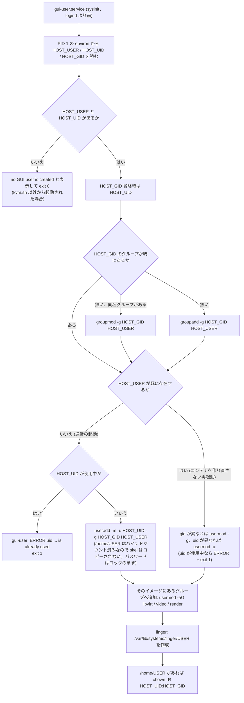

図 19: GUI ユーザーの作成。両コンテナで同じスクリプトが動く (パスワードは設定しない)。イメージには一般ユーザーが
入っていないので、通常の起動では毎回ここで新規作成する (`kvm.sh up` は毎回 `podman rm` してイメージから作る)。
uid/gid の再調整は `podman restart` のようにコンテナを作り直さずに再起動した場合の経路。
主グループの gid を変えても `libvirt` グループ (gid 985) への所属は変わらない。
linger は `loginctl enable-linger` と同じ効果を logind 起動前に得るため、ファイルを直接作る。

### 5.5 各 unit と設定の仕様

| unit / ファイル | イメージ | 種別 | 依存関係 | 内容 |
| --- | --- | --- | --- | --- |
| `gui-user.service` | 両方 | oneshot, RemainAfterExit | `DefaultDependencies=no`、`After=local-fs.target`、`Before=systemd-logind.service virtqemud.socket`、`WantedBy=sysinit.target` | `ExecStart=/usr/local/bin/gui-user-setup` (5.4 節) |
| `kvm-perms.service` | kvm | oneshot, RemainAfterExit | `DefaultDependencies=no`、`Before=virtqemud.socket virtqemud.service libvirtd.service`、`WantedBy=sysinit.target` | `chmod 0666 /dev/kvm /dev/net/tun`、`chown root:kvm /dev/kvm`、`sysctl -qw net.ipv4.ip_forward=1`。すべて失敗を無視 (`\|\| true`)。`/dev/dri` は扱わない (`kvm-gui` の `gui` が行う) |
| `kvm-libvirt-conf.service` | kvm | oneshot, RemainAfterExit | `DefaultDependencies=no`、`After=local-fs.target`、`Before=` 6 つの `virt*d.socket`、`WantedBy=sysinit.target` | `ExecStart=/usr/local/bin/libvirt-conf` (3.5 節) |
| `virtd-socket.conf` | kvm | drop-in (`virt{qemu,network,storage,nodedev,secret}d.socket.d/kvm-container.conf`) | | `[Socket]` `SocketMode=0660` `SocketGroup=libvirt` |
| `kvm-net-teardown.service` | kvm | oneshot, RemainAfterExit | `After=virtnetworkd.service virtqemud.service virtnetworkd.socket virtqemud.socket`、`Before=libvirt-guests.service`、`Wants=virtnetworkd.socket`、`WantedBy=multi-user.target`、`TimeoutStopSec=15` | `ExecStart=/bin/true`、`ExecStop` で全ネットワークの `net-destroy` と `virbr*` の `ip link del` (5.2 節) |
| `libvirt-guests.service` (パッケージの unit) + `/etc/sysconfig/libvirt-guests` | kvm | oneshot, RemainAfterExit, `TimeoutStopSec=0` | `After=virt-guest-shutdown.target virtqemud.socket ...` (パッケージ)、`WantedBy=multi-user.target` | `URIS=qemu:///system`、`ON_BOOT=ignore` (起動時は何もしない)、`ON_SHUTDOWN=shutdown` (既定の `suspend` = managed save ではなく ACPI シャットダウン)、`PARALLEL_SHUTDOWN=10`、`SHUTDOWN_TIMEOUT=120` (全体の上限)。`kvm.sh` の `KVM_STOP_TIMEOUT=180` はこれより長くする (5.2 節) |
| `systemd-logind.service` | 両方 | (unmask) | | GUI ユーザーの `user@UID` (コンテナの `/run/user/UID` と session bus) を起動するために必要 (ベースイメージはマスク済み) |
| `tmpfiles.d/x11.conf` | gui | マスク (`/dev/null` への symlink) | | ro マウントしたホストの `/tmp/.X11-unix` を systemd-tmpfiles に触らせない |

### 5.6 ブリッジ同期 (`sync_bridged_network`)

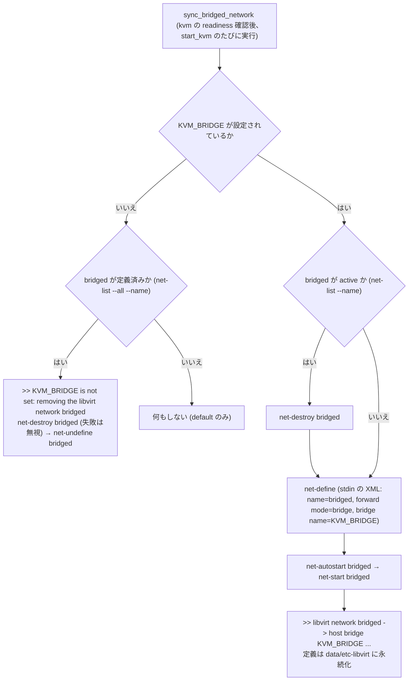

図 20: `bridged` ネットワークの同期 (`kvm` コンテナ内の virsh で実行)。ブリッジ自体の存在は起動前に `check_host_network` が確認済み。
毎回 define し直すので、`KVM_BRIDGE` の値を変えるとその値に追従する。`up gui` では実行されない。

## 6. 設計上の不変条件

以下はいずれも実際の不具合を踏んだ結果その形になっている (付録 B の PR 番号)。理由を理解せずに変えないこと。

```mermaid
flowchart LR
  subgraph bad ["やってはいけない構成"]
    b1["ホストの runtime dir を /run/user/UID にマウントする"]
    b2["/tmp/.X11-unix を rw でマウントする、または tmpfiles.d/x11.conf を有効にする"]
    b3["iscsid.socket / iscsiuio.socket を有効にする"]
    b4["NetworkManager.service を有効にする"]
    b5["NetworkManager-wait-online.service を有効にする"]
    b7["kvm-net-teardown.service 無しで停止する"]
    b8["seed コンテナや kvm-gui を label=disable 無しで動かす"]
    b9["systemd-logind をマスクしたままにする"]
    b10["kvm-gui から libvirt 既定の polkit 認証 (ソケット 0666) のまま接続する"]
    b11["libvirt グループの gid をパッケージ任せにする"]
    b12["/etc/libvirt の設定を Containerfile の sed で行う"]
    b13["/run/kvm-container/libvirt を空にせずに kvm を起動する、またはディレクトリごと消す"]
    b14["kvm-gui のセッション判定を省いて再利用する"]
    b15["libvirt-guests.service 無しで、または down の待ち時間を SHUTDOWN_TIMEOUT 以下にして kvm を止める"]
  end
  subgraph result ["起きること"]
    r1["コンテナの logind がホストの bus / systemd --user を作り直し、user@ の停止時に user-runtime-dir@ がホストの Wayland ソケットごと削除 (PR 10。当時は cockpit のログイン/ログアウトで発生)"]
    r2["コンテナの systemd-tmpfiles がホストの X ソケットを削除 (PR 10)"]
    r3["abstract unix ソケットがホストの iscsid と衝突し、起動が常に degraded (PR 15)"]
    r4["ホストの NIC・ブリッジを管理し始める (PR 14)"]
    r5["podman の eth0 が online にならず 60 秒待って degraded (PR 11)"]
    r7["virbr0 がホストに残り、次回 default の起動が File exists で失敗 (PR 14)"]
    r8["SELinux Enforcing で data/ (user_home_t) への書き込みや、spc_t のソケットへの connectto、runtime dir (user_tmp_t) の読み取りが拒否される (PR 15、PR 18)"]
    r9["GUI ユーザーの user@UID が起動せず、GUI アプリの session bus が無い (PR 2 では cockpit-bridge が落ちてログアウトされた)"]
    r10["別 pid 名前空間からの接続は SO_PEERCRED の pid が 0 で、polkit がクライアントを識別できず認証失敗 (PR 18)"]
    r11["両イメージで gid が食い違い、kvm-gui のユーザーが 0660 のソケットに届かない (PR 18)"]
    r12["data/etc-libvirt は空のときしか seed されないので、既存の data/ に設定が届かない (PR 18)"]
    r13["前回のソケット・pid・VM 状態が残ってデーモンが混乱する。ディレクトリを消すと起動中の kvm-gui が古い inode を見続ける (PR 18)"]
    r14["再ログイン後に古い (消えた) Wayland ソケットへ繋ぎ続け、画面に出ない (PR 18)"]
    r15["動いている VM が電源断と同じ状態で止まり、次の起動でファイルシステムのジャーナル復旧が走る (9.5 節)"]
  end
  b1 --> r1
  b2 --> r2
  b3 --> r3
  b4 --> r4
  b5 --> r5
  b7 --> r7
  b8 --> r8
  b9 --> r9
  b10 --> r10
  b11 --> r11
  b12 --> r12
  b13 --> r13
  b14 --> r14
  b15 --> r15
```

図 21: 禁止構成とその帰結。左の構成にすると右の不具合が再発する。

| 規則 | 実装箇所 | 補足 |
| --- | --- | --- |
| ホストの `XDG_RUNTIME_DIR` は `kvm-gui` の `/run/host-xdg-runtime` に **読み取り専用** でマウントし、`/run/user/UID` には絶対にマウントしない | `kvm.sh` `gui_args` / `HOST_RUNTIME_DIR` | ソケットは `map_rt_path` でコンテナ内の絶対パスに変換して環境変数で渡す。runtime dir 外の symlink 先はそのファイルだけを同じパスに ro マウント |
| コンテナ内の `/run/user/UID` は logind が作る。GUI ユーザーを linger にして起動時から存在させる | `gui-user-setup` `enable_linger`、`gui-user.service` の `Before=systemd-logind.service` | `kvm` では tmpfs。非特権の `kvm-gui` では tmpfs のマウントに失敗して systemd がディレクトリ作成にフォールバックする (想定内) |
| `/tmp/.X11-unix` は読み取り専用マウント、`tmpfiles.d/x11.conf` はマスク (`gui` イメージ) | `kvm.sh` `gui_args`、`Containerfile` | コンテナの systemd-tmpfiles にホストの X ソケットを消させない |
| コンテナをまたぐ libvirt 接続は `auth_unix_rw = "none"` + ソケット権限 `root:libvirt 0660` で制御し、`libvirt` の gid は `base` 段で固定する | `container/kvm/libvirt-conf`、`virtd-socket.conf`、`Containerfile` `LIBVIRT_GID` | 3.5 節。socket 起動では `.socket` unit の設定が権限を決める。`kvm-libvirt-conf.service` が起動ごとに冪等に書く (Containerfile で sed しない) |
| `/run/libvirt` はホストの `/run/kvm-container/libvirt` を両コンテナにバインドマウントしたもの。`start_kvm` が中身だけ空にし、`down` (引数なし) で消す | `kvm.sh` `start_kvm` / `down` | ディレクトリ自体は消さない (起動中の `kvm-gui` のマウントを壊さない) |
| `kvm-gui` は `--privileged` ではないが `--security-opt label=disable` | `kvm.sh` `start_gui` | SELinux Enforcing のホストで特権コンテナ (spc_t) のソケットへ connect し、ホストの runtime dir (user_tmp_t) を読むため。`/dev/dri` は `--device` で渡し、`gui` が `renderD*` を 0666 にする |
| 再ログイン後は `kvm-gui` だけ作り直す | `kvm.sh` `start_gui` / `gui_session_matches` | `GUI_ARGS` のハッシュをラベル `kvm.gui-session` に記録し、ラベルとコンテナ内のソケット実在の両方で判定する。`viewer` は必ず `up` を経由する |
| `--network host` の帰結を守る (両コンテナ): `iscsid.socket` / `iscsiuio.socket` / `NetworkManager.service` / `NetworkManager-wait-online.service` のマスク、停止時の `kvm-net-teardown` | `Containerfile` `base`、`kvm-net-teardown.service` | NetworkManager は今の依存では入らないが、マスクは残す。ホストのポートで listen するものは無い |
| `kvm` の停止では VM を先にシャットダウンする: `libvirt-guests.service` を有効にし、`kvm-net-teardown.service` はその後に止め (`Before=libvirt-guests.service`)、`down` は `SHUTDOWN_TIMEOUT` より長く待つ | `Containerfile` `kvm`、`container/kvm/libvirt-guests`、`kvm-net-teardown.service`、`kvm.sh` `KVM_STOP_TIMEOUT` | 起動時は何もしない (`ON_BOOT=ignore`)。qemu.conf の `auto_shutdown_*` は libvirt-guests と二重に動かないよう既定 (`none`) のまま |
| GUI ユーザーはホストユーザーの写し (名前・uid/gid)。`kvm.sh` は root で実行させない | `host_user_args`、`gui-user-setup` | ホストの runtime dir は 0700 なので uid 一致が必要。パスワードは設定しない |
| `data/` は空のときだけ `kvm` イメージから seed し、seed コンテナは `--security-opt label=disable` | `prepare_data_dir` | バインドマウントはイメージの内容をコピーしないため |
| `systemd-logind` はマスク解除する (`common` 段) | `Containerfile` | ベースイメージはマスク済み。GUI ユーザーの `user@UID` と session bus に必要 |
| ホスト → コンテナの値は PID 1 の environ 経由。`gui` は `runuser` 前に `unset` | `kvm.sh`、`gui-user-setup` `env_of_pid1`、`gui` | 新しい値もこの流儀で渡す |
| コンテナ名は `kvm` / `kvm-gui`、イメージ名は `localhost/kvm-container/{kvm,gui}` に固定 (変数名 `KVM_CONTAINER` / `GUI_CONTAINER` / `KVM_IMAGE` / `GUI_IMAGE`)。`NAME` は使わない | `kvm.sh` | 変数名の衝突を避ける |

## 7. セキュリティ考慮事項

| 項目 | 現状の扱い | 影響 |
| --- | --- | --- |
| `kvm` の権限 | `--privileged`、root の podman、`--network host`。SELinux のラベル分離は無効 | コンテナ内 root はホスト root と同等。信頼できるイメージ (このリポジトリの `build`) のみ使う前提 |
| `kvm-gui` の権限 | 非特権 (`--privileged` 無し、capability の追加無し)、`--security-opt label=disable`、`--network host`、`--device /dev/dri` | ホストのデスクトップに接続する GUI アプリを特権コンテナから切り離す。SELinux のラベル分離は無いので、ホスト側からは通常の非特権コンテナ相当 |
| libvirt へのアクセス制御 | polkit ではなくソケットの所有グループ (`root:libvirt 0660`) と `auth_unix_rw = "none"`。両コンテナの GUI ユーザーが `libvirt` グループ | `libvirt` グループ (gid 985) に入れるプロセスは誰でも `qemu:///system` を完全に操作できる。gid 985 を持つホスト側のプロセスも `/run/kvm-container/libvirt` 経由で届く |
| GUI ユーザーのパスワード | 設定しない (`useradd` のままロック)。ホストのパスワードやハッシュはコンテナに渡さない。sudoers も無い | コンテナにログインする経路は無い (操作は `sudo podman exec` = ホスト root 相当) |
| ホスト側の sudo | `launch` (Activities 起動) だけが `sudo -n podman` を要求する。通常の `kvm.sh` は対話的な `sudo` | podman の NOPASSWD sudo はホスト root 相当の権限付与になる。設定は利用者の判断 |
| libvirt / qemu | `security_driver = "none"`、`namespaces = []`。`/dev/kvm` `/dev/net/tun` は 0666、`kvm-gui` の `/dev/dri/renderD*` も 0666 | VM 間の SELinux / namespace 隔離は無い |
| ホストのセッション資源 | `kvm-gui` にのみ、runtime dir と `/tmp/.X11-unix` と Xauthority を読み取り専用で渡す | GUI アプリはホストのコンポジタに接続できる (画面・入力にアクセス可能) が、ホストのソケットを消したり作り直したりはできない |
| `data/` | root / qemu 所有。`clean` で削除 (確認あり、`KVM_CLEAN_YES=1` で省略)。`kvm-gui` からは `home` だけが見える (rw) | VM ディスクと定義はホストのファイルシステムに平文で置かれる |

## 8. 既知の制限事項

| 制限 | 内容 |
| --- | --- |
| SPICE 非対応 | RHEL 10 系の qemu-kvm に SPICE が無く、VM のグラフィックスは VNC |
| ホストの再ログイン | GNOME からログアウト/再ログインすると `/run/user/UID` が作り直され、`kvm-gui` に渡した Wayland ソケットのパスが無効になる。`./kvm.sh up` (または `viewer`) が `kvm-gui` だけを作り直す。`kvm` と VM は動いたまま |
| headless での GUI | `kvm.sh viewer` は `have_display` の判定で exit 2、`up gui` は exit 1。画面を表示する手段は無く、VM は `virsh` / `virt-install` で操作する |
| `kvm-gui` の `/run/user/UID` | 非特権なので tmpfs にならず `/run` 直下の通常のディレクトリ (systemd のフォールバック、想定内) |
| 1 コンテナ構成からの移行 | 旧構成の `kvm` コンテナは `/run/libvirt` を共有していないので、`./kvm.sh down` で消してから `./kvm.sh build && ./kvm.sh up` する。旧イメージ `localhost/qemu-kvm-cockpit` は `sudo podman rmi` で消せる。`data/` はそのまま使える (`kvm-libvirt-conf.service` が設定を更新する) |
| ホストの停止 | VM はコンテナ内の qemu。ホストの再起動・シャットダウンではコンテナごと止められ、`libvirt-guests` の 120 秒が確保される保証は無いので、先に `./kvm.sh down` する |
| ACPI に応じない VM | OS の無い VM や ACPI の電源ボタンを無視する OS は、`down` で 120 秒待ったあと電源断と同じ状態で止まる |
| VM の削除 | UEFI の VM は `virsh undefine` に `--nvram` が要る (無いと `Cannot undefine domain with NVRAM/varstore`)。`--remove-all-storage` は CD-ROM に入ったままの ISO も削除するので、`--storage <target>` で消すディスクを指定するか、先に `change-media --eject --config` する |
| `virt-install --initrd-inject` | `kvm` イメージに `cpio` が無いので `No such file or directory: 'cpio'` で失敗する。キックスタートは `OEMDRV` ラベルの ISO (`xorriso` はある) で渡す (9.5 節) |
| `virt-install` の既定ネットワーク | `--network` を省くと、virt-install はホストの既定経路のデバイスがブリッジ (またはブリッジのポート) ならそのブリッジを選ぶ。`--network host` なのでホストのブリッジが見え、`default` (NAT) にならないことがある |
| 起動確認のタイムアウト | `kvm` の readiness は 30 秒固定。遅いホストでは `could not confirm startup` になり得る (コンテナ自体は起動を続ける)。`kvm-gui` には readiness 待ちが無い |

```mermaid
stateDiagram-v2
  [*] --> NoImage
  NoImage : イメージ無し
  Kvm : kvm だけ起動中 (ディスプレイ無し、または down gui 後)
  Both : kvm + kvm-gui 起動中 (GUI 可)
  Stale : kvm 起動中、kvm-gui は古いセッション用
  Down : コンテナ無し (data/ は残る)
  NoData : コンテナ無し、data/ 無し (イメージは残る)
  NoImage --> Kvm : kvm.sh up (build と seed を自動実行、ディスプレイ無し)
  NoImage --> Both : kvm.sh up (ディスプレイあり)
  NoData --> Kvm : kvm.sh up (seed)
  Down --> Kvm : kvm.sh up (ディスプレイ無し) / up kvm
  Down --> Both : kvm.sh up (ディスプレイあり) / viewer
  Kvm --> Both : kvm.sh up / up gui / viewer
  Both --> Kvm : kvm.sh down gui
  Both --> Stale : ホストで再ログイン、DISPLAY 等の変更
  Stale --> Both : kvm.sh up / viewer (kvm-gui だけ作り直す)
  Both --> Down : kvm.sh down
  Kvm --> Down : kvm.sh down
  Stale --> Down : kvm.sh down
  Both --> NoData : kvm.sh clean (確認あり)
  Down --> NoData : kvm.sh clean (確認あり)
```

図 22: コンテナと `data/` のライフサイクル。`down` は `data/` を残し、`clean` だけが消す。イメージは `clean` でも残る。
`down kvm` だけを行うと `kvm-gui` は libvirt に届かない状態で残る (次の `up` で `kvm` が再起動し、共有 run dir が空にされるので復帰する)。

## 9. 検証手順

自動テストは無い。変更後は静的検査と、docs/setup.md の付録 (物理 AlmaLinux 10 + GNOME / ディスプレイ無し) と docs/vm.md の付録 (VM のライフサイクル) の確認手順を手で流す。本章はその期待結果と検証している項目の表。

### 9.1 静的検査

```bash
files="kvm.sh container/gui/gui container/common/gui-user-setup container/kvm/libvirt-conf"
bash -n $files
shellcheck $files          # 指摘ゼロを保つ (-S style でもゼロ)
# shellcheck がホストに無ければ gui イメージの使い捨てコンテナで実行できる
# (ShellCheck は EPEL にしかないので、この使い捨てコンテナの中でだけ epel-release を入れる):
sudo podman run --rm --security-opt label=disable -v "$PWD:/src:ro" localhost/kvm-container/gui \
  sh -c 'microdnf -y install epel-release >/dev/null && microdnf -y install ShellCheck >/dev/null && cd /src && shellcheck '"$files"
```

### 9.2 物理 AlmaLinux 10 + GNOME

| コマンド | 期待結果 | 検証していること |
| --- | --- | --- |
| `getenforce` | `Enforcing` のままで可 | SELinux を緩めずに動く (seed と `kvm-gui` の `label=disable`、`kvm` の `--privileged`) |
| `env \| grep -E 'DISPLAY\|WAYLAND\|XDG_RUNTIME\|XAUTH'` | 値が入っている | `gui_args` が表示先を取得できる |
| `./kvm.sh up` | `>> ready. VMs: ...` が出て `./kvm.sh virsh list` が通る | 起動シーケンス全体 (両コンテナ) |
| `for c in kvm kvm-gui; do sudo podman exec $c systemctl is-system-running; done` | どちらも `running` (`degraded` ではない) | Containerfile の unit マスク群が効いている **(実質的な回帰テスト)** |
| `sudo podman exec kvm ls -l /run/libvirt/virtqemud-sock` | `srw-rw---- root libvirt` | `virtd-socket.conf` の drop-in |
| `sudo podman exec kvm-gui runuser -u $USER -- virsh -c qemu:///system list` | VM 一覧が出る | コンテナをまたぐ libvirt 接続 **(回帰テスト)** |
| `sudo grep -h '^auth_unix_rw' data/etc-libvirt/virt*d.conf` | すべて `"none"` | `kvm-libvirt-conf.service` |
| `sudo podman exec kvm getent shadow $USER` | 第 2 フィールドが `!` | GUI ユーザーがロックされている (パスワードを渡していない) |
| `sudo podman exec kvm-gui ls -la /dev/dri` | `renderD*` が 0666 | `--device /dev/dri` と `gui` の chmod |
| `sudo ausearch -m avc -ts recent` | 拒否が無い | SELinux 上の問題が無い |
| `./kvm.sh virt-install ...` → `./kvm.sh viewer <VM名>` | VM が作られ、GNOME にウィンドウが出て VM のコンソールが見える | `virt-install` パススルー、session bus、Wayland 接続、共有ソケット経由の VNC |
| `./kvm.sh viewer` (VM 名なし) | VM 選択ダイアログが出る | `gui` の `--wait` 無しの経路 (5.3 節)。`install-desktop` 後は Activities の「Virt Viewer」も同じ |
| GNOME 再ログイン後に `./kvm.sh up` | `kvm-gui` だけが作り直され、`./kvm.sh virsh list` の VM が動いたまま | `gui_session_matches` (図 15) |
| `./kvm.sh down; ip link show virbr0; ls /run/kvm-container` | どちらも残っていない | `kvm-net-teardown` と共有 run dir の削除 |

### 9.3 ディスプレイ無し (headless)

グラフィカルセッションの外のシェル (SSH など) から流す。`KVM_HOST=headless` を付けない場合も、表示用環境変数が
無ければ同じ経路を通る (図 2)。

| コマンド | 期待結果 | 検証していること |
| --- | --- | --- |
| `KVM_HOST=headless ./kvm.sh up` | `>> ready. VMs: ...` の後に `>> no display found: GUI disabled (manage the VMs with ./kvm.sh virsh / virt-install)` | `have_display` が偽のときの `up` (図 2)。`kvm` の起動シーケンスは通常どおり |
| `KVM_HOST=headless ./kvm.sh up gui` | `!! no display found (DISPLAY / WAYLAND_DISPLAY unset, or KVM_HOST=headless): the GUI container is not needed` で exit 1 | `up gui` の拒否 (4.1 節) |
| `KVM_HOST=headless ./kvm.sh viewer` | `!! no display found (... ): virt-viewer needs a desktop session; manage the VMs with ./kvm.sh virsh` で exit 2 | `viewer` の拒否 (4.1 節) |
| `sudo podman exec kvm systemctl is-system-running` | `running` (`degraded` ではない) | Containerfile の unit マスク群 **(実質的な回帰テスト)** |
| `sudo podman ps` | `kvm` だけで `kvm-gui` が居ない | GUI コンテナを起動していない |
| `sudo podman exec kvm ls -l /run/libvirt/virtqemud-sock` | `srw-rw---- root libvirt` | `virtd-socket.conf` の drop-in |
| `sudo grep -h '^auth_unix_rw' data/etc-libvirt/virt*d.conf` | すべて `"none"` | `kvm-libvirt-conf.service` |
| `sudo podman exec kvm getent shadow $USER` | 第 2 フィールドが `!` | GUI ユーザーがロックされている (`kvm` にも GUI ユーザーは作られる) |
| `./kvm.sh virsh list --all` | 一覧が出る (VM が無ければヘッダだけ) | `kvm` の libvirt に `podman exec` で届く |
| `ip -br addr show virbr0` | `192.168.122.1/24` | `default` ネットワークがホスト上に作られている (`--network host`) |
| `sudo ausearch -m avc -ts recent` | 拒否が無い | SELinux Enforcing のまま動く |
| `./kvm.sh down; ip link show virbr0; ls /run/kvm-container` | どちらも残っていない | `kvm-net-teardown` と共有 run dir の削除 |

### 9.4 その他の確認点 (変更内容に応じて)

| 変更箇所 | 確認 |
| --- | --- |
| `KVM_BRIDGE` 周り | `./kvm.sh virsh net-list` で `bridged` が active。`KVM_BRIDGE` 無しで `up` すると消える |
| `down` | ホストに `virbr0` と dnsmasq と `/run/kvm-container` が残らない。`down` → `up` で VM 定義とディスクが復元される。動いている VM はシャットダウンされる (9.5 節) |
| `install-desktop` / `launch` | Activities の「Virt Viewer」から VM 選択ダイアログが開く。`kvm-gui` 未起動時と sudo 失敗時に通知が出る |
| GUI ユーザー | 両コンテナの `/etc/shadow` でユーザーがロックされている。コンテナには他に一般ユーザーが居ない |
| ロール引数 | `up kvm` は `kvm-gui` を起動しない。ディスプレイ無しで `up gui` は exit 1。`build gui` は `gui` イメージだけを作る |

### 9.5 VM のライフサイクル

OS の入った使い捨ての VM `lctest` で、作成から削除までを確認する (コマンドは docs/vm.md「付録: VM のライフサイクルの確認手順」)。
キックスタート (`poweroff`、`%packages` に `qemu-guest-agent`) を `OEMDRV` ラベルの ISO にして `--location <boot ISO>` でインストールすると、
インストール後に `shut off` になり、永続定義はディスク起動に切り替わる (kernel/initrd の直接起動と boot ISO は外れる)。
起動の確認は `virsh qemu-agent-command lctest '{"execute":"guest-ping"}'`、再起動の確認はシリアルログ
(`--serial pty,log.file=/var/log/libvirt/qemu/lctest-serial.log`、`kvm` のコンテナ内で非永続) の `Linux version` の行数で行う。

| 操作 | 期待結果 | 検証していること |
| --- | --- | --- |
| `virt-install ... --location ... --noautoconsole` | 数分で `shut off`。`domblklist` に `vda` (qcow2)、`vncdisplay` が `127.0.0.1:0` | `virt-install` パススルー、ゲストのネットワーク (インストーラがリポジトリに届く) |
| `virsh start` → guest agent | 10 秒前後で `guest-ping` が応答、`domifaddr --source agent` で IP が取れる | ディスクからの起動、guest agent のチャネル (`/run/libvirt/qemu/channel`) |
| `viewer lctest` | ログインプロンプトが見える | 共有ソケット経由の VNC |
| `virsh reboot` | シリアルログの `Linux version` が 1 行増え、guest agent が戻る。viewer は開いたまま | ACPI 再起動 |
| `virsh shutdown` (`--mode acpi` / `--mode agent`) | 数秒で `shut off (shutdown)`。viewer は自動で閉じる | ACPI と guest agent による停止 |
| `virsh suspend` → `resume` | `paused (user)` → `running (unpaused)` | |
| `virsh destroy` | `shut off (destroyed)` | 強制停止 |
| 停止中に `setvcpus ... --config` / `setmem ... --config` → `start` | 変更後の値で起動する (`guest-get-vcpus`) | `data/etc-libvirt/qemu/<VM>.xml` への永続化 |
| `snapshot-create-as` → `snapshot-revert` → `snapshot-delete` | すべて成功し、`running (from snapshot)` になる | qcow2 の内部スナップショット |
| VM 稼働中に `down kvm` | `>> shutting down the running VMs` が出て数秒で終わる。次の起動のシリアルログに `XFS (...): Starting recovery` が出ない | `libvirt-guests.service` による停止 (5.2 節)。無効だと 1 秒で終わり、復旧が走る |
| ACPI に応じない VM (例 `--pxe --disk none`) を動かしたまま `down kvm` | 約 120 秒で終わり、ホストに qemu・`vnet*`・`virbr0` が残らない | `SHUTDOWN_TIMEOUT` と `KVM_STOP_TIMEOUT` の関係 |
| `virsh autostart` → `down kvm` → `up kvm` | `running (booted)`。`data/etc-libvirt/qemu/autostart/` に symlink | 自動起動 |
| autostart 無しの VM を動かしたまま `down kvm` → `up kvm` | 定義が残り `shut off` のまま | `ON_BOOT=ignore` |
| UEFI の VM に `virsh undefine` (`--nvram` 無し) | `Cannot undefine domain with NVRAM/varstore` で失敗し、定義も残る | 8 章 |
| `virsh undefine <VM> --nvram --storage vda` | 定義・`qemu/nvram/<VM>_VARS.fd`・ディスクだけが消え、ISO は残る | 削除手順 (docs/vm.md「VM を削除する」) |
| CD-ROM に ISO を入れたまま `virsh undefine --remove-all-storage` | ISO も消える (使い捨ての ISO で確認する) | 8 章の注意が今も正しいか |

## 付録 A. ファイル一覧とコンテナ内配置

| リポジトリ内 | イメージ | コンテナ内 (Containerfile の COPY) | モード | 備考 |
| --- | --- | --- | --- | --- |
| `kvm.sh` | | (ホスト側) | 実行可能 | |
| `desktop/kvm-virt-viewer.desktop` | | (ホスト側、`install-desktop` が `~/.local/share/applications/` へ) | | `@KVM_SH@` を置換 |
| `Containerfile` | | | | マルチステージ: `base` → `common` → `kvm` / `gui` |
| `container/common/gui-user-setup` | 両方 | `/usr/local/bin/gui-user-setup` | `chmod +x` | |
| `container/common/gui-user.service` | 両方 | `/etc/systemd/system/gui-user.service` | | `systemctl enable` |
| `container/kvm/kvm-perms.service` | kvm | `/etc/systemd/system/kvm-perms.service` | | `systemctl enable` |
| `container/kvm/kvm-net-teardown.service` | kvm | `/etc/systemd/system/kvm-net-teardown.service` | | `systemctl enable` |
| `container/kvm/kvm-libvirt-conf.service` | kvm | `/etc/systemd/system/kvm-libvirt-conf.service` | | `systemctl enable` |
| `container/kvm/libvirt-conf` | kvm | `/usr/local/bin/libvirt-conf` | `chmod +x` | |
| `container/kvm/libvirt-guests` | kvm | `/etc/sysconfig/libvirt-guests` | | `libvirt-guests.service` を `systemctl enable` |
| `container/kvm/virtd-socket.conf` | kvm | `/usr/local/share/kvm-container/virtd-socket.conf` → `/etc/systemd/system/virt{qemu,network,storage,nodedev,secret}d.socket.d/kvm-container.conf` | 0644 (`install -D`) | |
| `container/gui/gui` | gui | `/usr/local/bin/gui` | `chmod +x` | |
| `.gitignore` | | | | `*.iso` `*.qcow2` `build.log` `data/` |
| `data/` (git 管理外) | | `kvm`: `/var/lib/libvirt` `/etc/libvirt` `/home/<HOST_USER>`、`kvm-gui`: `/home/<HOST_USER>` | バインドマウント | `up` が作成・seed |
| `/run/kvm-container/libvirt` (ホスト、非永続) | | 両方 `/run/libvirt` | バインドマウント | `up` が空にし `down` で削除 |

## 付録 B. 主要な変更履歴

不変条件がどの不具合から生まれたかの索引。詳細はコミットメッセージを参照。

| PR | 要旨 | 本書の関連節 |
| --- | --- | --- |
| 2 | `systemd-logind` のマスク解除。cockpit ログイン直後の自動ログアウトを修正 | 3.4、6 |
| 3 | 永続化を named volume からホストディレクトリのバインドマウントに変更 (seed 処理) | 4.6 |
| 5 | `install-desktop` / `launch` の追加 | 4.7 |
| 8 | Quadlet / sudoers 配置の廃止、コンテナ名・イメージ名・データディレクトリを固定値に | 1.3、3.3 |
| 9 | cockpit にホストのユーザー名・パスワードでログインできるように (ホストユーザーの写しを作る、ハッシュの env-file 渡し) | 4.3、5.4、7 |
| 10 | ホストの runtime dir を読み取り専用の別パスにマウント。cockpit ログアウトでホストの `/run/user/UID` が消える問題を修正。GUI ユーザーの linger | 4.4、5.3、6 |
| 11 | `NetworkManager-wait-online.service` をマスク。起動完了が 1 分遅れて degraded になるのを防ぐ | 3.4 |
| 13 | ベースイメージを AlmaLinux 10 minimal に変更、明示パッケージを最小化 | 3.4 |
| 14 | `--network host` と `KVM_BRIDGE` (libvirt ネットワーク `bridged`)、`cockpit-listen-generator`、`kvm-net-teardown.service`、NetworkManager のマスク | 4.5、5.2、5.6 |
| 15 | 物理 AlmaLinux 10 対応: seed の `label=disable`、`iscsid.socket` のマスク、cockpit 既定ポート 9091、ポート使用中の検出、firefox の URL をポートに追従 | 2.4、3.4、4.5 |
| 16 | CLAUDE.md の追加 | |
| 18 | コンテナをサーバ `kvm` とデスクトップクライアント `kvm-gui` に分割。マルチステージ Containerfile、`container/{common,kvm,gui}/`、共有 `/run/libvirt` とソケット権限による認証 (`auth_unix_rw = "none"`、`libvirt` の gid 固定)、`kvm-libvirt-conf.service`、`kvm.sh` のロール引数、セッション判定による `kvm-gui` だけの作り直し、ハッシュは `kvm` にだけ渡す | 1.1、3.2〜3.5、4.1、4.3、4.4、5.1、5.2、6 |
| 20 | イメージのテンプレートユーザー `admin` を廃止し、`gui-user-setup` が起動時に GUI ユーザーを作成する。`data/home` の seed 元は `/etc/skel` | 3.4、4.6、5.3、5.4 |
| 24 | virt-manager を削除。`kvm-gui` の `data/var-libvirt` (ro) マウントも削除 | 3.3、4.4、4.7 |
| 25 | cockpit と firefox を廃止。VM の操作は `kvm.sh virsh` / `virt-install` (新設)、画面は virt-viewer (`viewer` は VM 名省略で選択ダイアログ)。パスワードハッシュ・sudoers・`libvirtdbus`・`COCKPIT_*`・generator・`cockpit.conf`・`hostname` を削除し、ランチャーを `kvm-virt-viewer.desktop` に | 1.1、2.3、2.4、3.1〜3.5、4.1〜4.3、4.5、4.7、5.1、5.3〜5.5、6、7、8 |
| 26 | `down` で VM を先にシャットダウンする (`libvirt-guests`、`KVM_STOP_TIMEOUT`)。VM のライフサイクルの確認手順 | 3.5、5.2、9.5 |
| 27 | ドキュメントを手順書 4 本に再編し、README を一覧にする | |
| 28 | WSL2/WSLg 対応と `host_*` フックを削除し、`KVM_HOST` を `auto\|headless` に縮小。ディスプレイ無しのホストで通し確認 | 1.1、2.1、2.2、4.2、5.6、9.3 |
